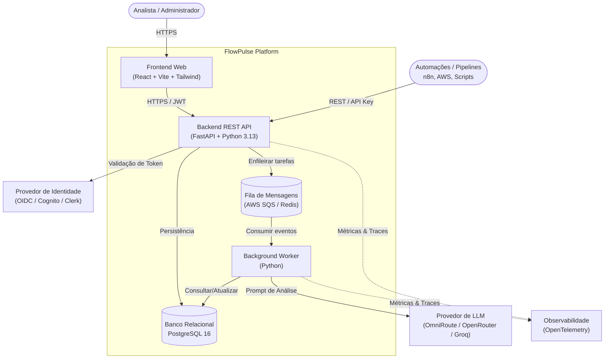

# FlowPulse

<p align="center">
  <strong>Plataforma centralizada de monitoramento, triagem e tratamento de incidentes para automações e pipelines de dados.</strong>
</p>

<p align="center">
  
  
  
  
  
  
  
  
</p>

---

## 📌 Sumário

- [Visão Geral](#-visão-geral)
  - [O Problema](#o-problema)
  - [A Solução](#a-solução)
- [Diferenciais & Funcionalidades](#-diferenciais--funcionalidades)
- [Tecnologia de Fronteira: Análise com IA](#-tecnologia-de-fronteira-análise-assistida-por-ia)
- [Fluxos Principais do MVP](#-fluxos-principais-do-mvp)
  - [1. Integração de uma Automação](#1-integração-de-uma-automação)
  - [2. Tratamento de Incidente](#2-tratamento-de-incidente)
- [Arquitetura & Stack Tecnológica](#-arquitetura--stack-tecnológica)
  - [Diagrama de Componentes](#diagrama-de-componentes)
  - [Stack de Tecnologias](#stack-de-tecnologias)
- [Estrutura do Repositório](#-estrutura-do-repositório)
- [Guia de Início Rápido (Quickstart)](#-guia-de-início-rápido-quickstart)
  - [Pré-requisitos](#pré-requisitos)
  - [Verificação do Ambiente](#verificação-do-ambiente)
  - [Configuração de Variáveis de Ambiente](#configuração-de-variáveis-de-ambiente)
  - [Execução Local com Docker](#execução-local-com-docker)
- [Documentação Detalhada](#-documentação-detalhada)
- [Protótipos de Interface](#-protótipos-de-interface)
- [Contribuindo & Governança](#-contribuindo--governança)
- [Licença](#-licença)

---

## 📖 Visão Geral

O **FlowPulse** é um projeto aplicado voltado ao acompanhamento centralizado de execuções, falhas e métricas operacionais de automações e pipelines de dados distribuídos.

### O Problema

Equipes técnicas lidam diariamente com dezenas de fluxos distribuídos em plataformas heterogêneas — como **n8n**, scripts em Python, orquestradores em nuvem (ex.: AWS Step Functions), bancos de dados e ferramentas de ETL.

Quando um processo falha, sofre *timeout* ou apresenta lentidão:
- A equipe descobre tarde devido à dispersão das notificações;
- Ocorre **fadiga de alertas** (*alert fatigue*), pois alertas chegam via e-mails ou mensagens isoladas sem priorização clara;
- A investigação exige alternar entre diversas ferramentas e consultar logs brutos;
- Falta visibilidade sobre quem está tratando cada ocorrência e quais problemas são reincidentes.

### A Solução

O **FlowPulse** centraliza os eventos de execução via API REST agnóstica, normaliza as informações e identifica desvios de tempo ou falhas. A partir dessa detecção, gera e gerencia **incidentes com ciclo de vida completo**, permitindo que o time priorize, investigue de forma assistida por Inteligência Artificial e registre resoluções com rastreabilidade.

---

## ⚡ Diferenciais & Funcionalidades

- **Centralização Agnóstica**: Coleta eventos de qualquer origem via API REST e credencial segura, sem necessidade de conectores proprietários complexos.
- **Foco em Incidentes, Não Apenas Logs**: Transforma exceções técnicas em incidentes gerenciáveis com severidade, responsável atribuído, status e prazos de resolução.
- **Ciclo de Vida Operacional**: Estados formais de tratamento (`OPEN` → `ACKNOWLEDGED` → `INVESTIGATING` → `RESOLVED`).
- **Métricas de Confiabilidade (DORA/SRE)**: Monitoramento de indicadores-chave como taxa de sucesso, falhas recorrentes, **MTTA** (*Mean Time to Acknowledge*) e **MTTR** (*Mean Time to Resolve*).
- **Controle de Acesso Baseado em Perfis (RBAC)**:
  - `ADMIN`: Gerencia automações, credenciais de integração, usuários e configurações.
  - `ANALYST`: Monitora execuções, assume incidentes, aciona suporte de IA e registra resoluções.
- **Privacidade e Segurança**: Sanitização de dados sensíveis antes de qualquer processamento e armazenamento seguro de credenciais via hashing.

---

## 🤖 Tecnologia de Fronteira: Análise Assistida por IA

O FlowPulse integra modelos de linguagem (LLMs) diretamente ao fluxo de investigação de incidentes:

- **Papel Consultivo**: A IA não executa correções em produção de forma autônoma; ela apoia o analista com inteligência contextual.
- **Relatório Estruturado de Apoio**:
  - **Resumo executivo do erro**: explicação clara do que falhou.
  - **Hipóteses prováveis de causa-raiz**: análise baseada no histórico e nos metadados da execução.
  - **Evidências coletadas**: logs, códigos de retorno e parâmetros relevantes.
  - **Próximos passos recomendados**: roteiro de diagnóstico sugerido para o analista.
  - **Grau de confiança**: indicador de precisão da análise gerada.
- **Gateways Flexíveis**: Suporte a provedores de mercado (OpenAI, Anthropic, Groq) e a gateways locais open-source (ex.: OmniRoute / OpenCode).

---

## 🔄 Fluxos Principais do MVP

### 1. Integração de uma Automação

Permite que o administrador registre e valide uma nova automação antes de habilitar o monitoramento produtivo:

```text
┌────────────────────┐
│ Cadastrar automação│ ➔ Nome, criticidade, duração esperada e responsável
└─────────┬──────────┘
          ▼
┌────────────────────┐
│  Gerar credencial  │ ➔ Chave de API única exibida uma única vez (hash armazenado)
└─────────┬──────────┘
          ▼
┌────────────────────┐
│Enviar teste (ping) │ ➔ Disparo de payload de validação para o endpoint da API
└─────────┬──────────┘
          ▼
┌────────────────────┐
│ Validar integração │ ➔ FlowPulse valida schema, autenticação e latência
└─────────┬──────────┘
          ▼
┌────────────────────┐
│Ativar monitoramento│ ➔ Status promovido para ACTIVE; pronta para eventos reais
└────────────────────┘
```

### 2. Tratamento de Incidente

Acompanhamento de ponta a ponta desde a falha do processo até a solução documentada:

```text
┌────────────────────┐
│ Receber execução   │ ➔ Evento enviado via API (started, success, failed, timeout)
└─────────┬──────────┘
          ▼
┌────────────────────┐
│ Detectar anomalia  │ ➔ Regra identifica falha técnica ou duração acima do SLA
└─────────┬──────────┘
          ▼
┌────────────────────┐
│  Criar incidente   │ ➔ Incidente aberto (OPEN) com severidade correspondente
└─────────┬──────────┘
          ▼
┌────────────────────┐
│ Assumir / Triagem  │ ➔ Analista reconhece a ocorrência (ACKNOWLEDGED / INVESTIGATING)
└─────────┬──────────┘
          ▼
┌────────────────────┐
│  Analisar com IA   │ ➔ LLM gera hipóteses de causa-raiz e checklist de investigação
└─────────┬──────────┘
          ▼
┌────────────────────┐
│Registrar resolução │ ➔ Analista insere notas da ação corretiva e encerra (RESOLVED)
└────────────────────┘
```

---

## 🏗 Arquitetura & Stack Tecnológica

O FlowPulse é estruturado como uma aplicação web modular, orientada a APIs REST e com processamento assíncrono para tarefas intensivas e chamadas a modelos de linguagem.

### Diagrama de Componentes



### Stack de Tecnologias

| Camada | Tecnologia | Descrição |
|---|---|---|
| **Frontend** | React 19 + TypeScript + Vite | Interface responsiva e performática estruturada em SPA |
| **Estilização** | Tailwind CSS + shadcn/ui | Design system focado em dashboards operacionais técnicos |
| **Backend API** | Python 3.13 + FastAPI | API assíncrona, de alto desempenho e tipada com Pydantic |
| **Persistência** | PostgreSQL 16 + SQLAlchemy + Alembic | Modelagem relacional para integridade e JSONB para metadados flexíveis |
| **Worker / Fila** | Python Worker + SQS / Redis | Processamento desacoplado de eventos e chamadas à IA |
| **Inteligência Artificial** | Modelos LLM via HTTPS / OmniRoute | Análise contextual com prompts estruturados e guardrails |
| **Observabilidade** | OpenTelemetry | Telemetria padronizada (logs estruturados, métricas e tracing) |
| **Infra & DevOps** | Docker + Docker Compose + Terraform | Empacotamento OCI padronizado e Infraestrutura como Código |
| **Testes** | Playwright + Pytest | Testes automatizados end-to-end e testes de unidade/integração |

---

## 📂 Estrutura do Repositório

```text
flowpulse/
├── docs/                       # Documentação técnica e de produto
│   ├── problem.md              # Definição e validação do problema
│   ├── prd.md                  # Documento de requisitos de produto (PRD)
│   ├── spec.md                 # Especificação técnica e contratos de API
│   ├── architecture.md         # Decisões de arquitetura e diagramas C4
│   ├── design.md               # Design system, tokens de cor e UI
│   ├── environment-setup.md    # Guia de configuração e ferramentas
│   └── refinement-review.md    # Revisão e fechamento do ciclo de discovery
├── apps/                       # Aplicações do monorepo (em implementação)
│   ├── web/                    # Frontend React SPA
│   ├── api/                    # Backend FastAPI
│   └── worker/                 # Worker assíncrono para filas e IA
├── packages/                   # Pacotes compartilhados
│   └── contracts/              # Schemas OpenAPI e contratos TypeScript/Pydantic
├── prototypes/                 # Especificações e referências de protótipos (Stitch)
├── scripts/                    # Utilitários de automação e validação de ambiente
│   └── check-environment.sh    # Script de checagem de pré-requisitos locais
├── tests/                      # Baterias de testes
│   ├── e2e/                    # Testes de ponta a ponta com Playwright
│   └── fixtures/               # Payloads e dados simulados de teste
├── .env.example                # Modelo de variáveis de ambiente do projeto
├── docker-compose.yml          # Orquestração de serviços para desenvolvimento
└── package.json                # Gerenciamento de scripts e dependências do repositório
```

---

## 🚀 Guia de Início Rápido (Quickstart)

### Pré-requisitos

Certifique-se de possuir instalado em sua máquina:
- [Git](https://git-scm.com/)
- [Node.js](https://nodejs.org/) (v18+) e [npm](https://www.npmjs.com/)
- [Python](https://www.python.org/) (v3.13+)
- [Docker](https://www.docker.com/) e [Docker Compose](https://docs.docker.com/compose/)

### Verificação do Ambiente

O repositório inclui um script para validar automaticamente se suas ferramentas estão prontas:

```bash
# Executa a verificação dos utilitários necessários
./scripts/check-environment.sh
```

### Configuração de Variáveis de Ambiente

Copie o template de ambiente e preencha as variáveis correspondentes:

```bash
cp .env.example .env
```

Principais parâmetros presentes no `.env`:
- `FRONTEND_PORT`: Porta do servidor web (padrão: `3000`).
- `BACKEND_PORT`: Porta da API FastAPI (padrão: `3001`).
- `DATABASE_URL`: String de conexão com o PostgreSQL.
- `NEXT_PUBLIC_CLERK_PUBLISHABLE_KEY` / `CLERK_SECRET_KEY`: Credenciais do provedor de identidade.
- `OMNIROUTE_API_KEY`: Chave do gateway local de IA (caso utilize Open Source AI).

### Execução Local com Docker

Suba a base de dados PostgreSQL e os serviços de suporte:

```bash
docker compose up -d
```

---

## 📚 Documentação Detalhada

Toda a concepção do FlowPulse está documentada em arquivos dedicados na pasta [`docs/`](docs/):

| Documento | Descrição e Finalidade |
|---|---|
| [`docs/problem.md`](docs/problem.md) | **Definição do Problema**: Análise de dores, impactos, evidências e objetivos de negócio. |
| [`docs/prd.md`](docs/prd.md) | **Product Requirements Document (PRD)**: Perfis de usuário, requisitos funcionais e não funcionais. |
| [`docs/spec.md`](docs/spec.md) | **Especificação Técnica**: Contratos de endpoints, schemas de eventos e regras de negócio. |
| [`docs/architecture.md`](docs/architecture.md) | **Arquitetura de Software**: Decisões técnicas, padrões, stack e modelos de persistência. |
| [`docs/design.md`](docs/design.md) | **Design System**: Princípios de interface, paleta de cores acessível (Dark Theme) e tipografia. |
| [`docs/environment-setup.md`](docs/environment-setup.md) | **Ambiente & Ferramentas**: Guia de preparação local, Open Source AI (OmniRoute/OpenCode) e contas externas. |
| [`docs/refinement-review.md`](docs/refinement-review.md) | **Revisão de Refinamento**: Matriz de coerência entre discovery, produto e arquitetura. |

---

## 🎨 Protótipos de Interface

Os protótipos de alta fidelidade e telas navegáveis do FlowPulse estão sendo desenvolvidos no **Stitch**, com base nas diretrizes visuais de [`docs/design.md`](docs/design.md) e nos fluxos de [`docs/spec.md`](docs/spec.md).

Para mais detalhes sobre as telas mapeadas e o roteiro de prototipagem, consulte [`prototypes/README.md`](prototypes/README.md).

---

## 👥 Contribuindo & Governança

1. Crie uma branch para a sua feature (`git checkout -b feature/nome-da-feature`).
2. Siga as convenções de commit padronizadas.
3. Certifique-se de que os testes locais e verificações passem (`npm test` / `pytest`).
4. Abra um Pull Request detalhando as alterações e referenciando as especificações pertinentes de `docs/`.

---

## 📄 Licença

Este projeto é desenvolvido no âmbito da Pós-Graduação da **PUC Minas** e está licenciado sob os termos da licença [ISC](LICENSE).
