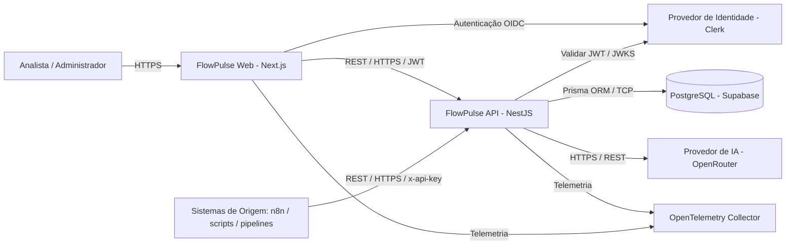
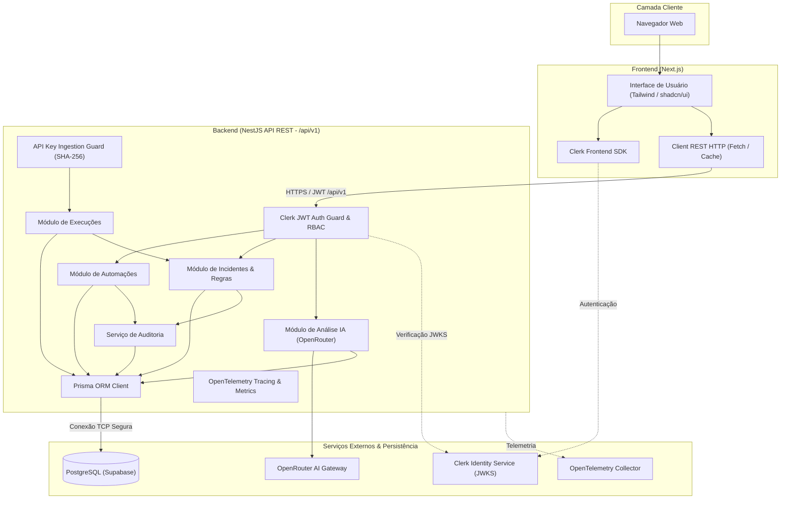
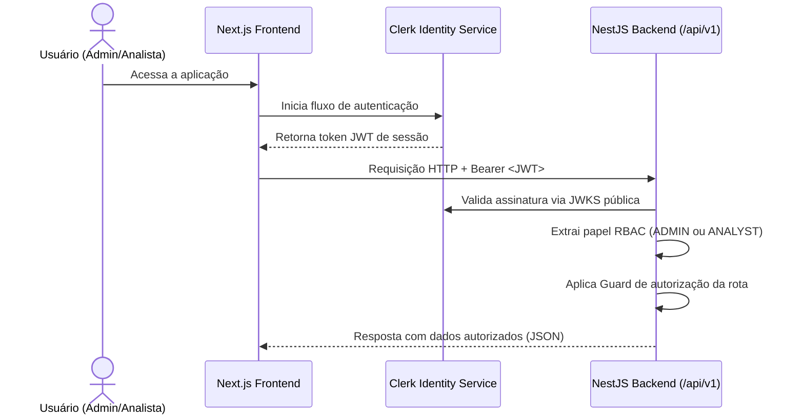

# Arquitetura de Software - FlowPulse

## Contexto Arquitetural

### Objetivo

Este documento define a arquitetura de software do **FlowPulse** e registra as decisões técnicas fundamentais para a implementação do Projeto Incremental V2, garantindo conformidade rigorosa com os requisitos de negócio, funcionais e não funcionais.

A arquitetura foi projetada para ser modular, escalável, testável e aderente às melhores práticas de engenharia de software em ambientes modernos de nuvem.

### Escopo

A arquitetura contempla:
- **Frontend Web:** aplicação moderna, responsiva e acessível em Next.js;
- **API Backend:** serviços estruturados e modulares em NestJS com API exclusivamente RESTful sob `/api/v1`;
- **Persistência de Dados:** modelagem e migrações relacionais gerenciadas via Prisma ORM conectado ao PostgreSQL hospedado no Supabase;
- **Autenticação e Autorização:** autenticação via Clerk e controle de acesso baseado em papéis (RBAC) validado no backend;
- **Inteligência Artificial:** integração real do backend com o OpenRouter para análise assistida de causa-raiz e diagnóstico operacional;
- **Observabilidade:** instrumentação completa com OpenTelemetry, logs estruturados em JSON, rastreabilidade por `request_id` e `trace_id`, e trilha de auditoria;
- **Qualidade de Software:** suíte de testes com Jest (unitários), Supertest/Jest (integração da API REST), Playwright (testes ponta a ponta E2E), além de lint e build obrigatórios;
- **Infraestrutura e DevOps:** contêineres compatíveis com OCI (Docker e Docker Compose), Infraestrutura como Código (IaC) com Terraform e automação de CI/CD com GitHub Actions.

### Arquitetura de Referência

- **Estilo Arquitetural:** Arquitetura web desacoplada (Frontend SPA/SSR + Backend RESTful em camadas modulares).
- **Comunicação:** Protocolo HTTPS com payloads em JSON UTF-8 sob o prefixo `/api/v1`.
- **Persistência Relacional:** Fonte única da verdade gerenciada via Prisma ORM no PostgreSQL do Supabase. O frontend não possui acesso direto à base de dados.
- **Segurança de Borda:** Autenticação gerenciada via Clerk, validação de tokens JWT no backend e papéis RBAC (`ADMIN` e `ANALYST`).
- **Observabilidade:** Padrões abertos com OpenTelemetry e logs estruturados correlacionados.

---

### Diagrama de Contexto



---

## Stack Tecnológica

### Frontend
- **Framework:** Next.js (React com App Router);
- **Linguagem:** TypeScript (modo estrito);
- **Estilização:** Tailwind CSS;
- **Biblioteca de Componentes:** shadcn/ui;
- **Autenticação:** SDK oficial do Clerk para Next.js (`@clerk/nextjs`);
- **Comunicação HTTP:** Fetch API / TanStack Query ou SWR para cache e mutação cliente-servidor.

### Backend
- **Framework:** NestJS (arquitetura modular com Controllers, Services, Modules e Guards);
- **Linguagem:** TypeScript (modo estrito);
- **Padrão de API:** Exclusivamente RESTful sob o prefixo global `/api/v1`;
- **Validação:** `class-validator` e `class-transformer` com validação de DTOs via `ValidationPipe`;
- **Autenticação e RBAC:** SDK do Clerk (`@clerk/backend`) com Auth Guards e verificação de assinatura JWT (JWKS);
- **Documentação:** OpenAPI / Swagger gerado dinamicamente via `@nestjs/swagger`.

### Persistência de Dados
- **SGBD:** PostgreSQL hospedado no Supabase;
- **ORM:** Prisma ORM (`@prisma/client`);
- **Migrações:** Prisma Migrate (`prisma migrate dev` / `prisma migrate deploy`);
- **Diretriz Mandatória:** O frontend não acessa diretamente o banco de dados nem utiliza o Supabase Data API (PostgREST). Todas as operações de negócio devem passar pela API REST do backend NestJS.

### Inteligência Artificial
- **Gateway/Provedor:** OpenRouter (acesso via REST HTTPS direto no backend);
- **Finalidade:** Análise assistida consultiva de incidentes (produção de resumo executivo, hipóteses de causa-raiz, evidências identificadas e próximos passos diagnósticos);
- **Restrição Estrita:** A IA não altera status do incidente nem executa comandos ou remediações automáticas.

### Observabilidade e Auditoria
- **Telemetria:** OpenTelemetry (SDK Node.js para traces distribuídos e métricas);
- **Logs Estruturados:** Formatação em JSON com correlação automática por `request_id` e `trace_id`;
- **Auditoria:** Gravação imutável de ações administrativas e transições de estado na tabela `audit_logs`.

### Qualidade e Testes
- **Testes Unitários:** Jest cobrindo regras de negócio, cálculo de severidade e serviços de domínio;
- **Testes de Integração:** Supertest com Jest cobrindo os controladores e endpoints REST da API NestJS;
- **Testes Ponta a Ponta (E2E):** Playwright cobrindo integralmente os dois fluxos centrais de negócio no frontend Next.js;
- **Governança de Qualidade:** Linting com ESLint, formatação com Prettier, validação de tipos TypeScript (`tsc --noEmit`) e verificação de build obrigatórios no pipeline.

### DevOps e Infraestrutura
- **Contêineres:** Docker multi-stage builds gerando imagens compatíveis com o padrão OCI;
- **Orquestração Local:** Docker Compose para desenvolvimento padronizado;
- **Infraestrutura como Código (IaC):** Terraform;
- **CI/CD:** GitHub Actions para pipelines automatizados de teste, validação, build e deploy;
- **Controle de Versão:** Git e GitHub com travas em branches e pull requests obrigatórios.

---

## Estrutura do Repositório

O projeto adota uma estrutura monorepo clara e escalável:

```text
flowpulse/
├── docs/                      # Documentação técnica e de produto
│   ├── problem.md             # Definição do problema (imutável)
│   ├── prd.md                 # Product Requirements Document
│   ├── spec.md                # Especificação técnica detalhada
│   ├── architecture.md        # Arquitetura de software e decisões
│   └── design.md              # Design system e diretrizes de interface
├── apps/
│   ├── web/                   # Frontend Next.js (App Router, Tailwind, Clerk)
│   │   ├── src/
│   │   │   ├── app/           # Rotas e páginas do Next.js
│   │   │   ├── components/    # Componentes de UI (shadcn/ui, cards, tabelas)
│   │   │   ├── lib/           # Utilitários e clientes de API
│   │   │   └── hooks/         # Custom hooks
│   │   ├── Dockerfile
│   │   └── package.json
│   └── api/                   # Backend NestJS (REST API, Prisma, OpenRouter)
│       ├── src/
│       │   ├── modules/       # Módulos: auth, automations, executions, incidents, ai
│       │   ├── common/        # Guards, interceptors, filters, decorators
│       │   ├── config/        # Configuração de ambiente e validação
│       │   └── main.ts        # Ponto de entrada com prefixo /api/v1
│       ├── prisma/            # Esquema Prisma e migrações
│       │   ├── schema.prisma
│       │   └── migrations/
│       ├── Dockerfile
│       └── package.json
├── infra/
│   └── terraform/             # Definição de IaC para recursos em nuvem
├── tests/
│   └── e2e/                   # Testes ponta a ponta com Playwright
├── docker-compose.yml         # Orquestração local dos serviços
├── .env.example               # Template de variáveis de ambiente
├── .github/
│   └── workflows/             # Pipelines de CI/CD (GitHub Actions)
├── package.json               # Gerenciador de monorepo / scripts raiz
└── README.md                  # Documentação inicial e guia rápido
```

---

## Visão de Componentes



---

## Adequação Funcional e Fluxos Centrais

### Fonte Única da Verdade
- **Regras de Negócio:** Centralizadas exclusivamente no backend NestJS. O frontend atua como consumidor e exibidor de interface, não duplicando regras críticas de transição de estado ou severidade.
- **Persistência:** Banco de dados relacional PostgreSQL no Supabase, acessado unicamente pelo Prisma ORM a partir do NestJS.
- **Política de Acesso a Dados:** É estritamente vedado ao frontend conectar-se diretamente ao PostgreSQL ou invocar o Supabase Data API / PostgREST.

### Rastreabilidade dos Dois Fluxos de Negócio Ponta a Ponta

#### FLUXO 1 - Integração de uma Automação
```text
1. Login ADMIN via Clerk
2. Cadastro da automação (nome, descrição, criticidade, duração esperada) em POST /api/v1/automations
3. Persistência via Prisma em status DRAFT
4. Geração de credencial em POST /api/v1/automations/{id}/api-keys (chave exibida uma vez, hash SHA-256 no banco)
5. Envio de teste real da integração em POST /api/v1/executions com flag is_test: true e cabeçalho x-api-key
6. Recebimento pela API REST, autenticação por hash e persistência no PostgreSQL do Supabase via Prisma
7. Ativação do monitoramento em POST /api/v1/automations/{id}/activate (status ACTIVE)
```

#### FLUXO 2 - Tratamento de Incidente
```text
1. Execução com falha enviada pela automação para POST /api/v1/executions
2. Recebimento pela API REST, autenticação e persistência da execução via Prisma
3. Motor de regras detecta falha/timeout ou duração acima do esperado e cria o incidente com severidade
4. Analista visualiza ocorrência no dashboard e aciona Assumir (POST /api/v1/incidents/{id}/acknowledge) -> status ACKNOWLEDGED
5. Analista move para investigação (POST /api/v1/incidents/{id}/start-investigation) -> status INVESTIGATING
6. Analista solicita análise assistida por IA (POST /api/v1/incidents/{id}/ai-analysis)
7. Backend NestJS sanitiza os dados e chama a API do OpenRouter
8. OpenRouter retorna resumo, causas prováveis, evidências e próximos passos (grau de confiança)
9. Análise é persistida em ai_analyses via Prisma e exibida no frontend com aviso consultivo
10. Analista aplica ações no ambiente de origem e registra nota de resolução (POST /api/v1/incidents/{id}/resolve)
11. Status transita para RESOLVED, com cálculo de MTTA/MTTR e registro de auditoria
```

---

## Autenticação e Segurança

### Fluxo de Autenticação com Clerk



### Chaves de Ingestão (API Keys)
- Geradas aleatoriamente no backend com prefixo legível (`fp_live_`);
- O segredo completo é exibido uma única vez ao usuário administrador;
- O banco armazena apenas o hash criptográfico SHA-256;
- Na ingestão (`POST /api/v1/executions`), o backend efetua o hash do cabeçalho `x-api-key` e busca a correspondência no banco, garantindo alta performance e segurança em repouso.

---

## Observabilidade e Telemetria

### OpenTelemetry (SDK Node.js)
A aplicação backend inicializa o SDK do OpenTelemetry antes dos módulos da aplicação:
- **Tracing:** Spans automáticos para requisições HTTP REST, queries do Prisma ORM e chamadas HTTPS externas para o OpenRouter;
- **Propagação de Contexto:** Headers `traceparent` propagados entre componentes;
- **Correlação:** Middleware global que assegura que toda requisição possua um `request_id` e um `trace_id`.

### Logs Estruturados em JSON
Logs emitidos em padrão JSON contendo:
```json
{
  "timestamp": "2026-09-20T10:30:00.123Z",
  "level": "INFO",
  "service": "flowpulse-api",
  "environment": "production",
  "trace_id": "4bf92f3577b34da6a3ce929d0e0e4736",
  "request_id": "req_c3a1b89d4ef7",
  "event_name": "EXECUTION_RECEIVED",
  "automation_id": "018e38f4-2f2b-7128-98e3-0d5bdf161111",
  "status": "failed"
}
```

---

## Qualidade e Estratégia de Testes

### Pirâmide de Testes

1. **Testes Unitários (Jest):**
   - Validação de cálculos de severidade (`CRITICAL`, `HIGH`, `MEDIUM`, `LOW`);
   - Cálculo de métricas operacionais (MTTA, MTTR, taxas de disponibilidade);
   - Sanitização de dados de entrada antes do envio para o OpenRouter;
   - Regras de domínio e DTOs de validação.

2. **Testes de Integração de API (Supertest + Jest):**
   - Execução contra a aplicação NestJS usando banco de teste;
   - Validação dos contratos de API sob `/api/v1`;
   - Teste dos Guards de autenticação do Clerk e verificação de RBAC (`ADMIN` vs `ANALYST`);
   - Teste de ingestão de eventos via `x-api-key` e persistência via Prisma;
   - Mock do gateway OpenRouter para validação de respostas estruturadas e tratamento de falhas técnicas (`503`).

3. **Testes Ponta a Ponta E2E (Playwright):**
   - **FLUXO 1 E2E:** Autenticação ADMIN -> Criação de automação -> Geração de credencial -> Execução de teste -> Ativação;
   - **FLUXO 2 E2E:** Ingestão de falha -> Criação automática de incidente -> Reconhecimento pelo analista -> Acionamento de análise de IA -> Preenchimento de resolução -> Status RESOLVED.

4. **Linting e Validação Estática:**
   - ESLint e Prettier aplicados no frontend e backend;
   - Verificação rigorosa de tipagem com TypeScript (`tsc --noEmit`);
   - Validação de compilação/build (`next build` e `nest build`).

---

## Portabilidade, Implantação e DevOps

### Ambientes

#### Ambiente de Desenvolvimento Local
Orquestrado via `docker-compose.yml`:
- Serviço `web`: container Node.js executando Next.js;
- Serviço `api`: container Node.js executando NestJS com Prisma Client;
- Banco de Dados: conexão direta com a instância do Supabase ou container Postgres local parametrizado via `.env`.

#### Ambiente de Produção
- Contêineres OCI imutáveis com builds multi-stage para redução de footprint e segurança (execução com usuário não-root);
- Infraestrutura provisionada e gerenciada através de scripts Terraform modulares;
- Variáveis de ambiente e segredos injetados de forma segura em runtime, sem nunca serem versionados no Git.

### Pipeline de CI/CD (GitHub Actions)

1. **Etapa de Validação (Pull Request):**
   - Checkout do código e instalação de dependências travadas via `package-lock.json`;
   - Linting e formatação;
   - Verificação estática de tipos TypeScript;
   - Execução dos testes unitários com Jest;
   - Execução dos testes de integração de API com Supertest e Jest;
   - Execução dos testes E2E com Playwright;
   - Validação de build das aplicações (`web` e `api`).

2. **Etapa de Deploy (Main Branch):**
   - Execução completa dos testes e verificações;
   - Build das imagens Docker OCI;
   - Validação do plano Terraform (`terraform plan`);
   - Aplicação controlada e deploy dos serviços;
   - Execução de smoke tests nos endpoints de healthcheck.

---

## Rastreabilidade dos Requisitos Não Funcionais (RNFs)

| Requisito | Descrição | Implementação Arquitetural |
|---|---|---|
| **RNF-01** | Acessibilidade e Portabilidade | Next.js, TypeScript, Tailwind CSS, conformidade WCAG 2.1 AA (navegação teclado, contraste, foco visível, status com texto). |
| **RNF-02** | Segurança | Clerk para autenticação, validação de tokens JWT no NestJS via Guards/JWKS, RBAC (`ADMIN` e `ANALYST`), chaves de API com hash SHA-256, HTTPS/TLS, proibição expressa de acesso do frontend ao banco ou Supabase Data API, sanitização de IA. |
| **RNF-03** | Interoperabilidade | API exclusivamente RESTful desenvolvida em NestJS sob o prefixo `/api/v1`, documentação OpenAPI/Swagger gerada automaticamente, JSON UTF-8. |
| **RNF-04** | Observabilidade e Rastreabilidade | Instrumentação com OpenTelemetry (SDK Node.js), logs estruturados em JSON, correlação com `request_id` e `trace_id`, auditoria completa de transições em `audit_logs`. |
| **RNF-05** | Manutenibilidade e Testabilidade | Monorepo tipado ponta a ponta com TypeScript. Testes unitários com Jest, integração com Supertest/Jest, E2E com Playwright. Lint e build obrigatórios no CI. |
| **RNF-06** | Portabilidade e Implantação | Containers compatíveis com OCI via Docker multi-stage, orquestração de desenvolvimento com Docker Compose, Infraestrutura como Código via Terraform, CI/CD automatizado via GitHub Actions. |
| **RNF-07** | Persistência | PostgreSQL hospedado no Supabase gerenciado por Prisma ORM com migrações versionadas (`prisma migrate`). Frontend restrito de interações diretas com o banco. |
| **RNF-08** | Governança de Código e Configuração | Repositório Git/GitHub com branch protection. Dependências declaradas e versionadas com lockfile (`package-lock.json`). Configurações externas exclusivamente por variáveis de ambiente, sem segredos versionados. |
