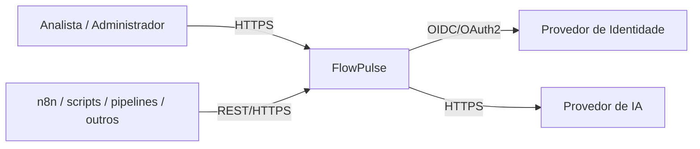
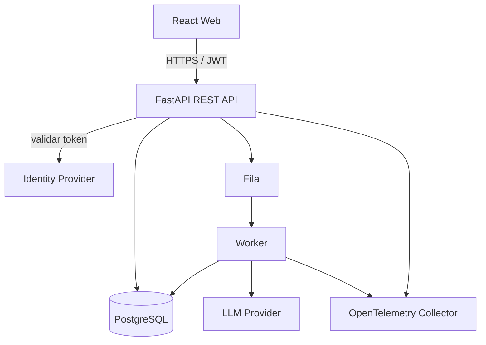
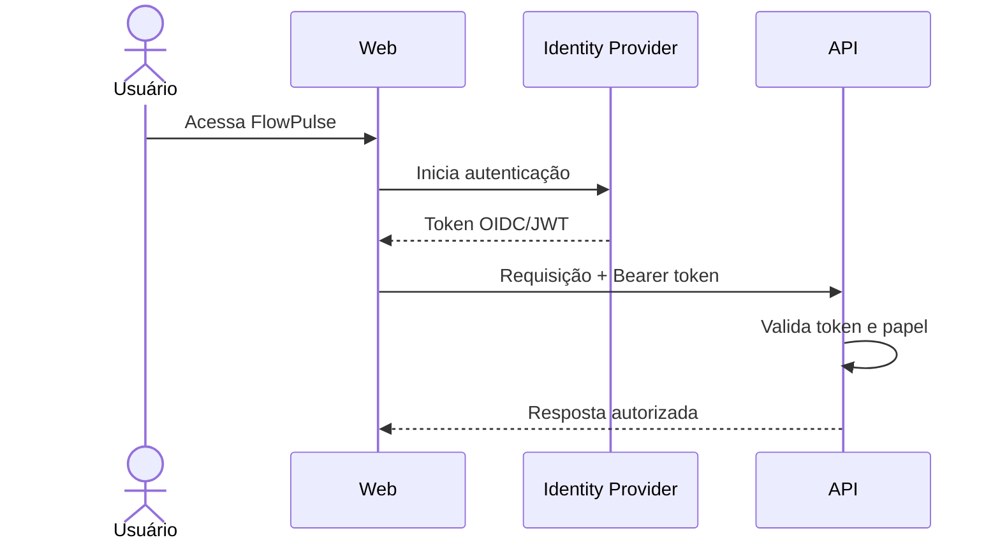
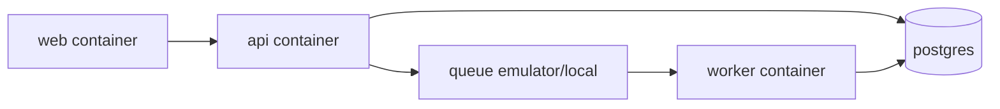
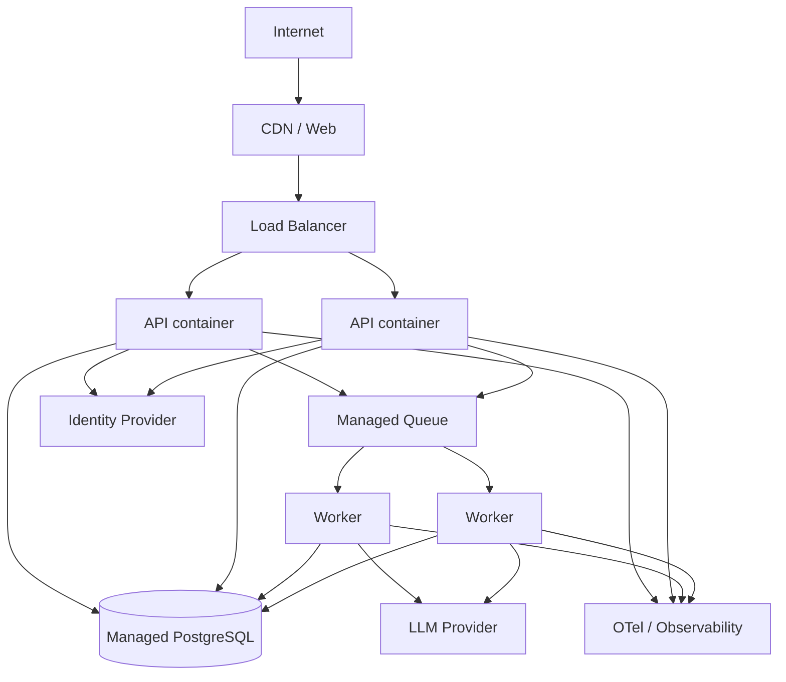

# Arquitetura de Software

## Contexto Arquitetural

### Objetivo

Este documento define a arquitetura do FlowPulse e registra as decisões técnicas necessárias para implementar o MVP de forma coerente com os requisitos funcionais e não funcionais.

A arquitetura foi pensada para permitir uma implementação acadêmica viável sem impedir evolução posterior.

### Escopo

A arquitetura contempla:

- frontend web;
- API backend;
- processamento de eventos;
- persistência;
- autenticação e autorização;
- integração com modelo de linguagem;
- observabilidade;
- infraestrutura;
- testes;
- CI/CD.

### Arquitetura de Referência

- Estilo arquitetural: aplicação web modular com API REST e processamento assíncrono.
- Comunicação: HTTPS + JSON para APIs; fila para tarefas assíncronas.
- Infraestrutura: contêineres OCI em ambiente gerenciado.
- Observabilidade: OpenTelemetry para traces e métricas, além de logs estruturados.
- Segurança: identidade externa + RBAC no backend.

### Diagrama de contexto



### Stack Tecnológica

#### Frontend

- Linguagem: TypeScript.
- Framework: React.
- Build: Vite.
- Roteamento: React Router.
- Estilização: Tailwind CSS.
- Componentes: shadcn/ui.
- Requisições/cache: TanStack Query.

#### Backend

- Linguagem: Python.
- Runtime: Python 3.13 ou versão estável compatível.
- Framework: FastAPI.
- Validação: Pydantic.
- ORM: SQLAlchemy.
- Migrations: Alembic.

#### Banco de Dados

- SGBD: PostgreSQL 16 ou superior compatível.
- Uso de JSONB apenas quando os campos forem realmente variáveis.

#### Processamento Assíncrono

- Fila: serviço compatível com fila de mensagens (AWS SQS em produção).
- Worker: serviço Python separado utilizando a mesma base de domínio do backend.

#### Observabilidade

- Instrumentação: OpenTelemetry.
- Produção: OpenTelemetry Collector/ADOT encaminhando telemetria para plataforma de observabilidade.

#### Identidade

- Provedor externo compatível com OIDC/OAuth2, inicialmente Amazon Cognito ou equivalente.
- Papéis de aplicação: `ADMIN` e `ANALYST`.

#### Inteligência Artificial

- Integração com provedor de LLM por HTTPS.
- Provedor e modelo configuráveis por variável de ambiente.
- Saída estruturada validada pelo backend.

#### DevOps

- CI/CD: GitHub Actions.
- Registry: registry OCI, com ECR como opção de produção.
- Infraestrutura como código: Terraform.
- Containers: Docker/OCI.

---

## Estrutura do Repositório

```text
flowpulse/
├── docs/
│   ├── problem.md
│   ├── prd.md
│   ├── spec.md
│   ├── architecture.md
│   └── design.md
├── apps/
│   ├── web/
│   ├── api/
│   └── worker/
├── packages/
│   └── contracts/
├── infra/
│   └── terraform/
├── tests/
│   ├── e2e/
│   └── fixtures/
├── docker-compose.yml
├── .env.example
├── .github/
│   └── workflows/
└── README.md
```

---

## Visão de Componentes



### Responsabilidades

#### Web

- interface;
- roteamento;
- formulários;
- visualização dos dados;
- envio de comandos para a API.

Não contém regras críticas de negócio.

#### API

- autenticação/autorização;
- contratos REST;
- regras de negócio síncronas;
- validação de payload;
- persistência;
- publicação de tarefas assíncronas.

#### Worker

- processamento de eventos que podem ser desacoplados;
- análise por IA;
- tarefas que exigem retry;
- geração de eventos técnicos.

#### Banco

Fonte única de verdade para dados de negócio do FlowPulse.

---

## Adequação Funcional

### Fonte Única de Verdade

- regras de negócio: camada de domínio/backend;
- dados de negócio: PostgreSQL;
- frontend não deve reproduzir regras críticas.

### Política de Comunicação entre Camadas

Operações de negócio devem ocorrer pela API.

É proibido:

- frontend acessar diretamente o banco;
- frontend utilizar credenciais administrativas;
- worker alterar dados sem passar pelas regras do domínio compartilhado.

### APIs e Versionamento

Base:

```text
/api/v1
```

Estratégia:

- versionamento por URL;
- OpenAPI gerado pelo backend;
- JSON;
- paginação para coleções;
- filtros e ordenação quando aplicáveis.

---

## Eficiência de Desempenho

### Comunicação

- HTTPS/JSON para requisições;
- fila para tarefas assíncronas;
- conexões ao banco por pool.

### Metas iniciais

- ingestão de evento: p95 abaixo de 500 ms sem considerar tarefas assíncronas;
- endpoints de leitura comuns: p95 abaixo de 800 ms em carga de MVP;
- criação do incidente: objetivo de ocorrer em até 5 segundos após processamento do evento.

As metas serão verificadas com testes de carga e ajustadas conforme o ambiente.

### Rate Limiting

- autenticação de usuário: conforme provedor;
- API de ingestão: limite por credencial/automação;
- análise de IA: limite por usuário e incidente.

### Escalabilidade

- API stateless;
- workers independentes;
- múltiplas réplicas atrás de balanceador;
- fila absorve picos;
- banco gerenciado com backup e possibilidade de réplica/evolução.

---

## Compatibilidade

### Integração

- API REST;
- webhook de entrada;
- JSON UTF-8.

### CORS

Somente origens conhecidas e configuradas por ambiente.

### Portabilidade

- desenvolvimento local via Docker Compose;
- componentes executáveis em containers OCI;
- configuração por variáveis;
- infraestrutura descrita em Terraform;
- evitar APIs proprietárias dentro do domínio sempre que possível.

---

## Usabilidade

### Diretrizes Frontend

- navegação consistente;
- feedback explícito de carregamento, sucesso e erro;
- estados vazios informativos;
- ações destrutivas com confirmação;
- severidade representada por texto/ícone além da cor.

### Experiência de Autenticação

- login por provedor externo;
- sessão expirada leva a reautenticação;
- usuário sem permissão recebe feedback apropriado.

---

## Confiabilidade

### Tratamento de Erros

API utiliza estrutura consistente baseada em Problem Details.

Erros técnicos não devem expor stack traces ao usuário.

### Auditoria

Operações auditadas:

- criação/alteração de automação;
- geração/revogação de credencial;
- atribuição de incidente;
- alteração de status;
- solicitação de análise de IA;
- resolução.

Campos mínimos:

- ator;
- ação;
- recurso;
- timestamp;
- request/trace id.

### Migrations

- toda mudança de esquema deve utilizar migration;
- migrations versionadas no Git;
- alterações manuais no banco de produção são proibidas.

### Testes Automatizados

- Lint: Ruff (backend) e ESLint (frontend).
- Unidade: Pytest e Vitest.
- Integração: Pytest com banco de teste.
- E2E/aceite: Playwright.

### Cobertura Mínima

Meta inicial:

- regras de domínio backend: 80%;
- frontend de componentes críticos: 70%.

Cobertura não substitui os testes ponta a ponta dos fluxos de negócio.

### Critérios de Teste

Toda regra crítica deve contemplar:

- happy path;
- sad path;
- edge cases.

---

## Segurança

### Princípios Gerais

- menor privilégio;
- deny by default;
- segredos fora do código;
- validação no servidor;
- rastreabilidade de operações sensíveis.

### Gestão de Identidade

O provedor externo é responsável por:

- autenticação;
- recuperação;
- política de sessão;
- MFA quando configurado.

### Autenticação



### Autorização

- RBAC.
- `ADMIN`: administração e operação.
- `ANALYST`: operação de incidentes e consulta.

Validação sempre no backend.

### Chaves de Integração

- segredo mostrado uma vez;
- persistência apenas do hash;
- prefixo visível para identificação;
- possibilidade de revogação;
- uma automação pode rotacionar credenciais.

### Transporte

- HTTPS obrigatório fora do ambiente local;
- TLS moderno administrado pela plataforma de infraestrutura.

### Segurança de Dados

- evitar armazenar payload completo quando não necessário;
- dados enviados ao LLM passam por sanitização;
- nenhum segredo deve ser encaminhado ao provedor de IA;
- backups e criptografia do banco habilitados em produção.

---

## Manutenibilidade

### Organização

- separação de interface, aplicação, domínio e infraestrutura no backend;
- componentes de UI reutilizáveis;
- contratos de API versionados.

### Convenções

- formatação automatizada;
- lint obrigatório;
- commits e pull requests revisáveis;
- documentação atualizada junto das mudanças relevantes.

### Variáveis de Ambiente

Exemplos:

```text
DATABASE_URL
OIDC_ISSUER
OIDC_AUDIENCE
AI_PROVIDER
AI_API_KEY
OTEL_EXPORTER_OTLP_ENDPOINT
QUEUE_URL
APP_ENV
```

É proibido versionar valores secretos.

---

## Portabilidade e Implantação

### Containers

- Dockerfiles compatíveis com OCI;
- imagens imutáveis;
- healthcheck;
- usuário não-root quando aplicável.

### Ambiente Local



Orquestração local por Docker Compose.

### Produção de Referência



A implementação de referência poderá utilizar AWS ECS/Fargate, RDS PostgreSQL, SQS, ECR e Cognito, todos provisionados por Terraform.

---

## Observabilidade

### OpenTelemetry

Instrumentar:

- requisições HTTP;
- chamadas ao banco;
- publicação/consumo de mensagens;
- chamadas ao provedor de IA.

Propagar:

- `trace_id`;
- `span_id`;
- `request_id`.

### Logs Estruturados

Campos mínimos:

- timestamp;
- level;
- service;
- environment;
- trace_id;
- request_id;
- event_name;
- resource_id quando aplicável.

Não utilizar `print`/`console.log` como estratégia de observabilidade em produção.

### Métricas

- requests por rota;
- latência;
- taxa de erro;
- eventos ingeridos;
- incidentes criados;
- mensagens na fila;
- falhas no worker;
- chamadas e falhas do provedor de IA.

---

## CI/CD

### Pull Request

1. instalação de dependências;
2. lint;
3. testes de unidade;
4. testes de integração;
5. build das imagens.

### Main

1. todas as validações;
2. build de imagens OCI;
3. publicação no registry;
4. aplicação do Terraform/plano controlado;
5. deploy;
6. smoke test.

---

## Evolução Planejada

- conectores específicos;
- regras configuráveis;
- detecção de anomalias;
- agrupamento inteligente de incidentes;
- automações de remediação com aprovação;
- integração com ITSM.

---

## Limites de Implementação do MVP

Não será implementado no MVP:

- execução autônoma de correções pela IA;
- billing;
- app mobile;
- multi-tenant comercial complexo;
- substituição de plataformas completas de observabilidade.
