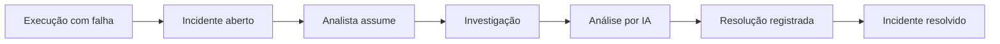

# Design System - FlowPulse

## 1. Objetivo

O design system do FlowPulse foi definido para uma aplicação de operação técnica em que o usuário precisa entender rapidamente o que está normal, o que precisa de atenção e qual é o próximo passo.

A interface deve passar sensação de controle e clareza. O foco não é criar uma tela visualmente chamativa, mas reduzir ruído e ajudar na tomada de decisão.

---

## 2. Princípios

### Clareza antes de densidade

É melhor mostrar menos informações com boa hierarquia do que transformar o dashboard em uma parede de métricas.

### Severidade precisa ser óbvia

Incidentes críticos devem ser percebidos rapidamente, mas o produto não deve deixar toda a interface vermelha.

### Cor não pode ser a única informação

Todo status deve combinar cor com texto e, quando fizer sentido, ícone.

### Ação próxima do contexto

Ações como assumir, investigar e resolver devem estar no detalhe do incidente e não escondidas em menus distantes.

### Consistência

Os mesmos estados, termos, ícones e padrões de interação devem ser utilizados em todas as telas.

---

## 3. Identidade Visual

### Nome

**FlowPulse**

### Conceito

O nome combina fluxo de execução com a ideia de pulso/saúde. A identidade visual deve refletir monitoramento contínuo, sem utilizar uma estética excessivamente "hacker".

### Personalidade

- técnica;
- confiável;
- objetiva;
- moderna;
- discreta.

---

## 4. Cores

O produto utilizará tema escuro como padrão no protótipo inicial, mantendo contraste suficiente para leitura.

### Cores principais

| Token | Uso | Valor |
|---|---|---|
| `--color-bg` | fundo principal | `#0B0F17` |
| `--color-surface` | cards e sidebar | `#111827` |
| `--color-surface-2` | superfícies elevadas | `#172033` |
| `--color-border` | bordas | `#263248` |
| `--color-text` | texto principal | `#F3F4F6` |
| `--color-text-muted` | texto secundário | `#9CA3AF` |
| `--color-primary` | ação principal | `#7C6CF2` |
| `--color-primary-hover` | hover primário | `#8F82F5` |

### Estados

| Estado | Valor | Uso |
|---|---|---|
| Success | `#22C55E` | execução saudável/resolvido |
| Warning | `#F59E0B` | atenção |
| High | `#F97316` | alta severidade |
| Critical | `#EF4444` | falha crítica |
| Info | `#38BDF8` | informação |

### Acessibilidade

- contraste mínimo de 4.5:1 para textos comuns;
- não usar somente verde/vermelho para comunicar estado;
- badges devem apresentar texto;
- gráficos devem utilizar legenda e padrões distinguíveis.

---

## 5. Tipografia

Família principal:

```text
Inter, system-ui, sans-serif
```

Fallback para código e logs:

```text
JetBrains Mono, ui-monospace, monospace
```

### Escala

| Token | Tamanho | Uso |
|---|---:|---|
| Display | 32px / 40px | títulos especiais |
| H1 | 28px / 36px | título de página |
| H2 | 22px / 30px | seção |
| H3 | 18px / 26px | card/seção |
| Body | 14px / 22px | conteúdo padrão |
| Small | 12px / 18px | metadados |
| Mono | 13px / 20px | logs e IDs |

Peso:

- Regular 400;
- Medium 500;
- Semibold 600;
- Bold 700 somente quando necessário.

---

## 6. Grid e Espaçamento

Base de espaçamento: **4px**.

Escala:

```text
4, 8, 12, 16, 24, 32, 40, 48, 64
```

### Layout desktop

- sidebar: 240px;
- conteúdo com largura fluida;
- padding lateral: 24-32px;
- cards em grid responsivo;
- largura máxima opcional de 1600px.

### Breakpoints

- mobile: `< 640px`;
- tablet: `640-1023px`;
- desktop: `>= 1024px`.

Em mobile, sidebar vira drawer.

---

## 7. Componentes

### Button

Variantes:

- Primary;
- Secondary;
- Ghost;
- Destructive.

Estados:

- default;
- hover;
- focus;
- disabled;
- loading.

### Status Badge

Exemplos:

- `Aberto`;
- `Reconhecido`;
- `Em investigação`;
- `Resolvido`;
- `Crítico`;
- `Alto`;
- `Médio`;
- `Baixo`.

Sempre utilizar texto + cor.

### Metric Card

Estrutura:

- label;
- valor;
- comparação opcional;
- informação auxiliar;
- ícone opcional.

Evitar cards com informação repetida.

### Table

Utilizada para:

- automações;
- execuções;
- incidentes.

Deve suportar:

- ordenação;
- filtros;
- paginação;
- estado vazio;
- loading;
- erro.

### Timeline

Utilizada no detalhe do incidente.

Eventos possíveis:

- incidente criado;
- responsável atribuído;
- status alterado;
- análise de IA concluída;
- incidente resolvido.

### Code / Log Block

- fonte monoespaçada;
- quebra controlada;
- botão copiar;
- área rolável para conteúdo longo;
- dados sensíveis mascarados quando aplicável.

### AI Analysis Card

A análise gerada pelo modelo de linguagem através do OpenRouter é exibida em um card dedicado, visualmente diferenciado de informações confirmadas pelo sistema para reforçar sua natureza consultiva.

Construído com componentes baseados em shadcn/ui e estilizado com Tailwind CSS.

Estrutura:
- Badge / cabeçalho com ícone: "Análise Assistida por IA (OpenRouter)";
- Aviso visual de isenção de responsabilidade: "Recomendação consultiva. A IA não executa remediações automáticas nem altera o status do incidente.";
- Resumo executivo (`summary`);
- Hipóteses prováveis de causa-raiz (`likely_causes`);
- Evidências detectadas nos logs/dados (`evidence`);
- Próximos passos diagnósticos recomendados (`next_steps`);
- Indicador visual de nível de confiança (`confidence`, ex: 88%).

---

## 8. Navegação

Menu principal:

```text
Dashboard
Automações
Execuções
Incidentes
Configurações
```

`Configurações` aparece conforme permissão.

O logo/nome do FlowPulse permanece no topo da sidebar.

---

## 9. Telas Principais

### Login

Objetivo: entrada segura no sistema via Clerk.

Elementos:
- logo e nome do FlowPulse;
- subtítulo descritivo;
- componente de autenticação do Clerk (`<SignIn />`) estilizado com Tailwind CSS para harmonizar com a paleta dark do FlowPulse;
- feedback amigável de redirecionamento e erros de sessão.

### Dashboard

Objetivo: visão consolidada e imediata da saúde das automações e incidentes.

Elementos:
- métricas em destaque: total de execuções no período, taxa de sucesso global, incidentes abertos, incidentes críticos, MTTA (tempo médio de reconhecimento) e MTTR (tempo médio de resolução);
- gráfico de volume de execuções (sucesso vs falha);
- tabela resumida de incidentes recentes que demandam atenção imediata;
- ranking de automações com maior índice de instabilidade.

### Automações

Objetivo: listagem e gestão de todos os processos monitorados.

Colunas:
- nome e descrição;
- origem (n8n, Python, Step Functions, etc.);
- criticidade (`LOW`, `MEDIUM`, `HIGH`);
- status (`DRAFT`, `ACTIVE`, `INACTIVE`);
- data/hora da última execução recebida;
- taxa recente de sucesso;
- responsável padrão;
- ações (detalhes, gerenciar credenciais, ativar/desativar).

### Nova Automação / Integração (FLUXO 1)

Fluxo em etapas (wizard progressivo com indicador de passos):
1. **Dados Básicos:** nome, descrição, origem;
2. **Parâmetros Operacionais:** definição de criticidade (`LOW`, `MEDIUM`, `HIGH`) e limite de duração esperada em segundos;
3. **Geração de Credencial:** backend gera a chave de API e a interface exibe o token em texto plano uma única vez com botão de cópia segura;
4. **Teste Real da Integração:** instruções de envio, payload de exemplo e escuta ativa de requisição de teste para `POST /api/v1/executions` (`is_test: true`);
5. **Ativação:** confirmação do recebimento do teste em tempo real e botão para transição imediata para `ACTIVE`.

### Incidentes

Objetivo: triagem e gestão da fila operacional de incidentes.

Filtros:
- status (`OPEN`, `ACKNOWLEDGED`, `INVESTIGATING`, `RESOLVED`);
- severidade (`LOW`, `MEDIUM`, `HIGH`, `CRITICAL`);
- responsável (atribuídos a mim, não atribuídos, todos);
- automação;
- período de ocorrência.

### Detalhe do Incidente (FLUXO 2)

Blocos e disposição:
1. **Cabeçalho:** identificador do incidente, severidade destacada com badge (cor + texto + ícone), status atual e botões de ação sensíveis ao estado (ex.: "Assumir Incidente", "Iniciar Investigação", "Resolver Incidente");
2. **Dados da Execução Primária:** automação de origem, horário de início e término, duração calculada, identificador externo de execução;
3. **Erro e Logs:** tipo do erro (`error_type`), mensagem técnica (`error_message`) em bloco monoespaçado e metadados contextuais em JSON formatado;
4. **Card de Análise Assistida por IA (OpenRouter):** botão para solicitar análise, seguido pelo card estruturado contendo resumo, causas prováveis, evidências, próximos passos diagnósticos, indicador de confiança e aviso consultivo;
5. **Linha do Tempo (Timeline):** histórico cronológico de todos os eventos auditáveis (`incident_events`);
6. **Resolução:** formulário dedicado para inserção da descrição da solução técnica (`resolution_notes`) e confirmação do encerramento do incidente (`RESOLVED`).

---

## 10. Fluxo Visual - Incidente



---

## 11. Estados de Interface

Toda tela que consulta dados deverá tratar:

- loading;
- sucesso;
- vazio;
- erro;
- sem permissão.

Exemplo de estado vazio em Incidentes:

> Nenhum incidente encontrado para os filtros selecionados.

Não utilizar apenas uma tabela vazia sem explicação.

---

## 12. Feedback

### Sucesso

Toast curto para ações como:

- automação criada;
- integração ativada;
- incidente assumido;
- incidente resolvido.

### Erro

A mensagem deve explicar:

1. o que aconteceu;
2. se a ação foi concluída;
3. o que o usuário pode fazer.

Evitar mensagens genéricas como "Algo deu errado" quando houver informação útil.

---

## 13. Acessibilidade

Requisitos:

- navegação completa por teclado;
- foco visível;
- labels associados aos campos;
- `aria-label` quando necessário;
- sem dependência exclusiva de cor;
- contraste mínimo compatível com WCAG 2.1 AA;
- áreas clicáveis adequadas;
- mensagens de erro anunciáveis por tecnologia assistiva;
- gráficos com alternativa textual/legenda.

---

## 14. Responsividade

### Desktop

Experiência completa com sidebar fixa e múltiplas colunas.

### Tablet

Sidebar recolhível. Cards reorganizados em duas colunas.

### Mobile

- menu em drawer;
- cards em coluna única;
- tabelas podem utilizar cards/resumo ou rolagem horizontal controlada;
- ações principais permanecem acessíveis;
- detalhes de log não devem quebrar o layout.

---

## 15. Design Tokens

Exemplo inicial:

```css
:root {
  --radius-sm: 6px;
  --radius-md: 10px;
  --radius-lg: 14px;

  --space-1: 4px;
  --space-2: 8px;
  --space-3: 12px;
  --space-4: 16px;
  --space-6: 24px;
  --space-8: 32px;

  --color-bg: #0B0F17;
  --color-surface: #111827;
  --color-border: #263248;
  --color-text: #F3F4F6;
  --color-text-muted: #9CA3AF;
  --color-primary: #7C6CF2;

  --color-success: #22C55E;
  --color-warning: #F59E0B;
  --color-high: #F97316;
  --color-critical: #EF4444;
}
```

---

## 16. Diretrizes para o Stitch

Os protótipos devem ser gerados utilizando `prd.md`, `spec.md` e este design system como contexto.

Telas mínimas:

1. Login;
2. Dashboard;
3. Automações;
4. Cadastro/integração de automação;
5. Execuções;
6. Incidentes;
7. Detalhe do incidente;
8. análise de IA dentro do incidente.

Após a geração:

- avaliar Preview;
- gerar pelo menos uma variação;
- gerar protótipo navegável;
- testar Interact;
- validar os dois fluxos principais;
- registrar no repositório o link/evidências do projeto no Stitch.

---

## 17. Critérios para Validação do Design

O protótipo será considerado adequado se:

- o usuário identificar um incidente crítico sem precisar navegar por várias telas;
- o fluxo de integração de uma automação possuir começo e término claros;
- o fluxo de incidente possuir começo e término claros;
- status e severidade não dependerem apenas de cor;
- o layout funcionar em desktop e mobile;
- análise de IA estiver claramente identificada como sugestão;
- ações principais estiverem próximas do contexto onde são necessárias.
