# Design: 02-auth-rbac

## Context

Com a fundação do monorepo estabelecida na change `01-project-foundation`, o FlowPulse possui a infraestrutura base de backend NestJS e frontend Next.js 15, com conexão relacional via Prisma e script canônico de testes.

A change `02-auth-rbac` introduz a camada formal de identidade da plataforma, alinhada a `@docs/spec.md`, `@docs/architecture.md` e `@docs/prd.md`:
- O **Clerk** atua como provedor de identidade externo (IdP), gerenciando credenciais de usuários, sessões e emissão de tokens JWT.
- O **backend NestJS (`apps/api`)** é a autoridade máxima de segurança da aplicação: valida a assinatura criptográfica dos tokens JWT utilizando `CLERK_SECRET_KEY` e suporte a `CLERK_JWT_KEY` (chave pública para validação local eficiente), gerencia a autorização por papéis (`ADMIN` e `ANALYST`) via Guards e sincroniza os dados no PostgreSQL (Supabase) via Prisma ORM de forma estritamente confiável e idempotente.
- O **frontend Next.js 15 (`apps/web`)** adota as convenções modernas do `@clerk/nextjs`, mantendo o `middleware.ts` com `clerkMiddleware()` sem recorrer a APIs depreciadas como `createRouteMatcher()`. A proteção de rotas privadas é reforçada próximo ao recurso (Server Components no layout `/(protected)` com `await auth.protect()`). A rota `/dashboard` consome os dados do usuário a partir do backend via `GET /api/v1/users/me` renderizado no servidor.

---

## Goals / Non-Goals

### Goals
- Integrar autenticação real via Clerk no frontend Next.js 15 com páginas públicas `/sign-in` e `/sign-up`, mantendo a rota `/` pública.
- Adotar as variáveis canônicas e não depreciadas do Clerk (`NEXT_PUBLIC_CLERK_SIGN_IN_FALLBACK_REDIRECT_URL`, `NEXT_PUBLIC_CLERK_SIGN_UP_FALLBACK_REDIRECT_URL`).
- Proteger rotas privadas (`/(protected)` e `/dashboard`) próximo ao recurso via Server Components e `await auth.protect()`.
- Validar tokens JWT no backend com `@clerk/backend`, suportando `CLERK_SECRET_KEY` e `CLERK_JWT_KEY` (chave pública PEM para validação local rápida e sem roundtrip de rede).
- Implementar provisionamento seguro de papéis (RBAC):
  - Novo usuário recebe `ANALYST` por padrão.
  - Papel `ADMIN` concedido apenas se o email primário verificado constar na lista configurada no backend `FLOWPULSE_ADMIN_EMAILS`.
  - Rejeitar ou ignorar qualquer papel enviado pelo cliente ou proveniente de `unsafeMetadata`.
- Sincronização confiável de usuários no PostgreSQL usando `clerk_user_id` (`sub`) como identificador principal, garantindo idempotência e integridade.
- Implementar a página protegida `/dashboard` consumindo `GET /api/v1/users/me` no lado do servidor para exibir o papel efetivamente persistido no banco de dados.
- Implementar suíte completa de testes cobrindo atribuição de papéis, tentativa de autoatribuição, endpoints 401, 403 e 200, idempotência de sincronização e renderização autenticada/não-autenticada.

### Non-Goals
- Autenticação por chave de API de automações (`ApiKeyGuard` com hash SHA-256 de `x-api-key`) — change 03.
- Módulos de automações, execuções e incidentes — changes 03 e 04.
- Dashboard de métricas analíticas e MTTA/MTTR — change 05.
- Testes E2E com Playwright de múltiplos navegadores — change 06.
- Infraestrutura produtiva, Docker multi-stage e Terraform — change 07.

---

## Decisions

### D-01: Variáveis de Redirecionamento Modernas do Clerk

**Decisão:** Utilizar exclusivamente as variáveis canônicas e atuais recomendadas pelo Clerk:
- `NEXT_PUBLIC_CLERK_SIGN_IN_URL=/sign-in`
- `NEXT_PUBLIC_CLERK_SIGN_UP_URL=/sign-up`
- `NEXT_PUBLIC_CLERK_SIGN_IN_FALLBACK_REDIRECT_URL=/dashboard`
- `NEXT_PUBLIC_CLERK_SIGN_UP_FALLBACK_REDIRECT_URL=/dashboard`

As variáveis legadas `NEXT_PUBLIC_CLERK_AFTER_SIGN_IN_URL` e `NEXT_PUBLIC_CLERK_AFTER_SIGN_UP_URL` estão expressamente depreciadas no Clerk SDK e não serão utilizadas no projeto.

---

### D-02: Suporte a `CLERK_JWT_KEY` no Backend para Validação Server-Side

**Decisão:** Configurar o backend (`apps/api`) para validar tokens JWT utilizando `@clerk/backend`, aceitando:
1. `CLERK_SECRET_KEY`: chave secreta para interação com a API do Clerk e validação;
2. `CLERK_JWT_KEY`: chave pública do Clerk (string PEM/base64 sem cabeçalhos ou completa) configurável no `.env`.

Quando `CLERK_JWT_KEY` estiver configurada, a verificação do token JWT pode ser realizada localmente sem requisições de rede para obter o JWKS a cada validação, reduzindo a latência a quase zero e garantindo resiliência em caso de oscilações externas. Nenhuma chave real será versionada no Git.

---

### D-03: Proteção de Rotas em Next.js 15 Próximo ao Recurso (Sem `createRouteMatcher`)

**Decisão:** Em `apps/web`:
1. Manter `src/middleware.ts` com `clerkMiddleware()` executando a extração e repasse da sessão.
2. Não utilizar a API depreciada `createRouteMatcher()`.
3. Manter a rota raiz `/` pública (apresentando status do sistema e links de entrada).
4. Manter `/sign-in` e `/sign-up` públicas.
5. Aplicar a proteção das rotas privadas no nível de layout Server Component em `src/app/(protected)/layout.tsx`:

```typescript
import { auth } from '@clerk/nextjs/server';

export default async function ProtectedLayout({
  children,
}: {
  children: React.ReactNode;
}) {
  // auth.protect() redireciona automaticamente para /sign-in se não autenticado
  await auth.protect();

  return (
    <div className="min-h-screen bg-zinc-950 text-zinc-100">
      {/* Header com UserButton e navegação */}
      {children}
    </div>
  );
}
```

**Racional:** Segue as diretrizes mais recentes do Next.js 15 e do Clerk SDK, promovendo proteção declarativa e coesa junto aos componentes do App Router, eliminando expressões regulares frágeis no middleware.

---

### D-04: Provisionamento de Roles e Proteção Contra Privilégios Indevidos

**Decisão:** 
1. **Padrão de novos usuários:** Qualquer usuário novo autenticado no Clerk recebe `Role.ANALYST` no banco relacional local.
2. **Atribuição do papel `ADMIN`:** O papel `ADMIN` só é concedido pelo backend se o email do usuário constar na lista definida na variável de ambiente `FLOWPULSE_ADMIN_EMAILS` (emails separados por vírgula, e.g. `admin@flowpulse.io,lead@flowpulse.io`).
3. **Validação de email verificado:** O backend só considera emails com confirmação de verificação primária pelo Clerk (`email_verified === true` nos claims ou no objeto verificado do Clerk).
4. **Desconfiança de entrada do cliente:**
   - O backend nunca aceita campos de role enviados pelo frontend no corpo da requisição ou headers.
   - Metadados não seguros do cliente (`unsafeMetadata`) são estritamente desconsiderados para RBAC.
   - Apenas a configuração do backend e os claims assinados do IdP são fontes autoritativas.

---

### D-05: Sincronização Confiável e Idempotente (Clerk -> User)

**Decisão:** O método `UsersService.findOrCreateByClerkId(clerkData: TrustedClerkUser)`:
1. Utiliza `clerk_user_id` (`sub`) como chave de identidade primária e imutável.
2. Dados cadastrais (`email`, `name`) são extraídos do token validado ou da chamada direta do backend ao Clerk, nunca de payloads soltos do cliente.
3. Caso já exista um usuário cadastrado com o mesmo email verificado (mas sem `clerk_user_id` gravado), o backend associa o `clerk_user_id` a essa conta existente mantendo o histórico e preservando seu `id` UUID.
4. Caso o usuário já exista com `clerk_user_id`, atualiza os dados cadastrais necessários de forma idempotente, sem duplicar registros.
5. Se for o primeiro acesso e o email constar em `FLOWPULSE_ADMIN_EMAILS`, persiste com role `ADMIN`; caso contrário, persiste com `ANALYST`.

---

### D-06: Página `/dashboard` com Chamada Server-Side a `GET /api/v1/users/me`

**Decisão:** A página `apps/web/src/app/(protected)/dashboard/page.tsx` é um Server Component que:
1. Obtém o token de sessão do Clerk no servidor via `auth().getToken()`.
2. Executa a requisição `GET ${process.env.NEXT_PUBLIC_API_URL}/users/me` passando o cabeçalho `Authorization: Bearer ${token}`.
3. Renderiza o perfil obtido do banco de dados, exibindo o papel persistido (`ADMIN` ou `ANALYST`), ID do Clerk e email.
4. Exibe o controle de logout (`<UserButton />` ou botão customizado com `signOut`).

**Racional:** Garante que o papel renderizado na tela seja o papel verificado e persistido pelo backend, prevenindo qualquer discrepância visual com relação à autorização real do sistema.

---

### D-07: Guard de Autenticação (`ClerkAuthGuard`) e RBAC (`RolesGuard`)

**Decisão:**
- `ClerkAuthGuard`:
  - Intercepta `Authorization: Bearer <token>`.
  - Valida com `@clerk/backend` (`verifyToken(token, { jwtKey, secretKey })`).
  - Em falha, lança `UnauthorizedException` (RFC 7807 HTTP 401).
  - Em sucesso, invoca `UsersService.findOrCreateByClerkId()` e anexa a entidade do banco a `request.user`.
- `RolesGuard`:
  - Lê `@Roles()` via `Reflector`.
  - Se a rota não exigir papéis específicos, libera o acesso para qualquer usuário autenticado.
  - Se a rota exigir papéis (ex: `@Roles(Role.ADMIN)`), verifica se `request.user.role` é compatível.
  - Se não for, lança `ForbiddenException` (RFC 7807 HTTP 403).

---

## Architecture Diagrams

### Fluxo de Autenticação, Proteção e Sincronização Server-Side

```mermaid
sequenceDiagram
    autonumber
    actor Usuario as Usuário (Browser)
    participant NextPage as Next.js 15 (Server Component)
    participant ClerkIdP as Clerk (IdP)
    participant NestApi as NestJS API (/api/v1)
    participant DB as PostgreSQL (Supabase)

    Usuario->>NextPage: Acessa /dashboard
    Note over NextPage: src/app/(protected)/layout.tsx
    NextPage->>ClerkIdP: auth.protect() verifica sessão
    alt Sem sessão ativa
        NextPage-->>Usuario: Redireciona para /sign-in
    else Sessão ativa
        NextPage->>ClerkIdP: auth().getToken()
        ClerkIdP-->>NextPage: Bearer JWT
        NextPage->>NestApi: GET /api/v1/users/me (Bearer <JWT>)
        
        rect rgb(24, 24, 37)
        Note over NestApi: Backend NestJS
        NestApi->>NestApi: ClerkAuthGuard intercepta token
        NestApi->>NestApi: Valida JWT com CLERK_JWT_KEY / CLERK_SECRET_KEY
        alt JWT inválido ou expirado
            NestApi-->>NextPage: 401 Unauthorized (RFC 7807)
        else JWT válido
            NestApi->>DB: UsersService.findOrCreateByClerkId(sub, email_verificado)
            Note over NestApi,DB: Avalia FLOWPULSE_ADMIN_EMAILS -> ADMIN ou ANALYST
            DB-->>NestApi: Retorna User persistido no banco
            NestApi->>NestApi: RolesGuard valida permissões
            NestApi-->>NextPage: 200 OK com { id, clerk_user_id, role, email, ... }
        end
        end

        NextPage-->>Usuario: Renderiza Dashboard com role persistido no banco e <UserButton />
    end
```



---

## Data Model Changes

### Prisma Schema (`apps/api/prisma/schema.prisma`)

```prisma
enum Role {
  ADMIN
  ANALYST
}

model User {
  id            String   @id @default(uuid())
  clerk_user_id String   @unique
  email         String   @unique
  name          String
  role          Role     @default(ANALYST)
  created_at    DateTime @default(now())
  updated_at    DateTime @updatedAt

  @@map("users")
}
```

---

## Environment Variables Configuration

### Atualização no `.env.example`:
```bash
# Clerk Authentication Configuration
# Frontend (apps/web)
NEXT_PUBLIC_CLERK_PUBLISHABLE_KEY=pk_test_placeholder
NEXT_PUBLIC_CLERK_SIGN_IN_URL=/sign-in
NEXT_PUBLIC_CLERK_SIGN_UP_URL=/sign-up
NEXT_PUBLIC_CLERK_SIGN_IN_FALLBACK_REDIRECT_URL=/dashboard
NEXT_PUBLIC_CLERK_SIGN_UP_FALLBACK_REDIRECT_URL=/dashboard

# Backend (apps/api)
CLERK_SECRET_KEY=sk_test_placeholder
CLERK_JWT_KEY=placeholder_public_key_pem_or_jwk
FLOWPULSE_ADMIN_EMAILS=admin@flowpulse.io
```

---

## Test Strategy & Coverage Matrix

### 1. Testes Unitários (`apps/api`)
- **Provisionamento de Roles:**
  - Usuário novo com email comum recebe `Role.ANALYST`.
  - Usuário com email verificado listado em `FLOWPULSE_ADMIN_EMAILS` recebe `Role.ADMIN`.
  - Tentativa de enviar role no payload ou em `unsafeMetadata` é ignorada, mantendo a regra autoritativa do servidor.
- **Sincronização Idempotente (`UsersService`):**
  - Primeira sincronização cria o registro com sucesso.
  - Sincronizações subsequentes com o mesmo `clerk_user_id` retornam o mesmo registro sem duplicar no banco.
  - Vinculação com conta prévia de mesmo email verificado preenche `clerk_user_id` mantendo o `id` original.
- **`ClerkAuthGuard`:**
  - Token ausente ou sem formato `Bearer` → HTTP 401 RFC 7807.
  - Token com assinatura inválida ou expirado → HTTP 401 RFC 7807.
  - Token válido → injeta dados do banco em `request.user` e retorna `true`.
- **`RolesGuard`:**
  - Rota sem restrição com usuário autenticado → retorna `true`.
  - Rota `@Roles(Role.ADMIN)` com usuário `ADMIN` → retorna `true`.
  - Rota `@Roles(Role.ADMIN)` com usuário `ANALYST` → HTTP 403 RFC 7807.
  - Rota `@Roles(Role.ADMIN, Role.ANALYST)` com usuário `ANALYST` → retorna `true`.

### 2. Testes de Integração (`apps/api` - Supertest)
- `GET /api/v1/users/me` sem cabeçalho `Authorization` → HTTP 401 RFC 7807 com `request_id`.
- `GET /api/v1/users/me` com token válido → HTTP 200 com perfil contendo o papel persistido.
- Rota protegida de teste `@Roles(Role.ADMIN)` com token de usuário `ANALYST` → HTTP 403 RFC 7807 com `request_id`.
- Rota protegida com token de usuário `ADMIN` → HTTP 200.
- `POST /api/v1/users/sync` → HTTP 200 idempotente.

### 3. Testes Frontend (`apps/web` - Jest)
- Acesso à rota protegida em estado não autenticado aciona proteção e redirecionamento.
- Acesso à rota protegida em estado autenticado renderiza o Dashboard consumindo `GET /api/v1/users/me` e exibindo o papel persistido no backend e os controles de encerramento de sessão.
