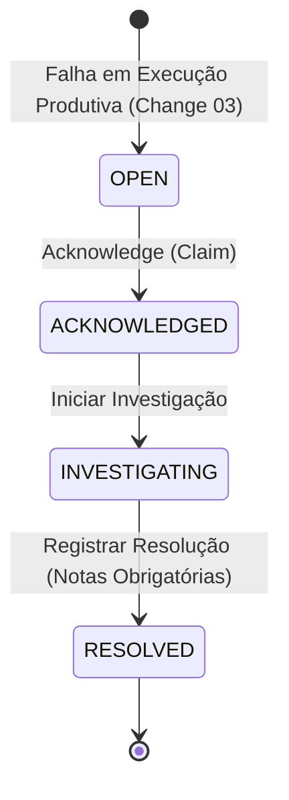
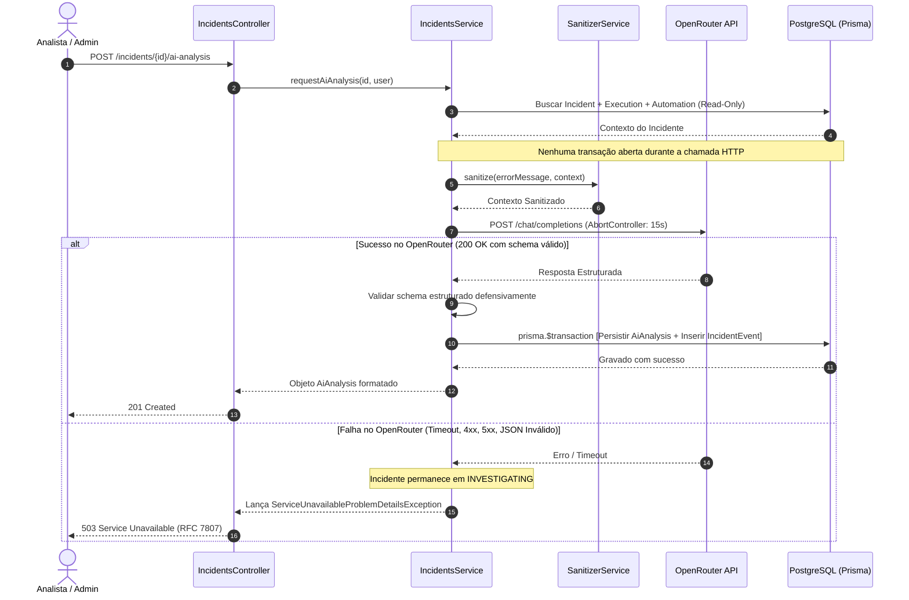

# Design: 04-incident-lifecycle-ai

## 1. Contexto e Visão Geral

A change `04-incident-lifecycle-ai` formaliza e implementa o segundo fluxo de negócio central do FlowPulse (**Fluxo 2: Tratamento e Ciclo de Vida de Incidentes com Apoio de IA**). 

Com base nas fundações de autenticação e RBAC da change `02-auth-rbac` e na criação automática de incidentes em status `OPEN` decorrentes de execuções com falha em automações ativas implementada na change `03-automation-integration`, esta change entrega a cadeia operacional completa:
1. Assunção e atribuição do incidente pelo operador humano (`OPEN → ACKNOWLEDGED`);
2. Início formal da investigação (`ACKNOWLEDGED → INVESTIGATING`);
3. Diagnóstico assistido via integração real com o provedor de IA **OpenRouter** (`anthropic/claude-haiku-4.5`) utilizando structured output rigoroso com validação de esquema no backend;
4. Sanitização determinística prévia de logs e mensagens de erro antes de qualquer tráfego para provedores externos;
5. Registro obrigatório de notas explicativas de resolução e encerramento do incidente (`INVESTIGATING → RESOLVED`);
6. Trilha imutável de eventos operacionais (`IncidentEvent`) vinculada a cada transição;
7. Interface visual responsiva e acessível em Next.js 15 App Router seguindo estritamente as diretrizes de `@docs/design.md` e WCAG 2.1 AA.

---

## 2. Metas e Não-Metas (Goals / Non-Goals)

### Metas
- Estender o modelo relacional `Incident` adicionando `assigned_to_id`, `acknowledged_at`, `investigating_at`, `resolved_at` e `resolution_notes`, preservando os dados já existentes no banco local gerados pela change 03.
- Criar os modelos relacionais `IncidentEvent` (rastreabilidade de histórico) e `AiAnalysis` (diagnósticos persistidos da IA).
- Implementar máquina de estados determinística e estritamente linear (`OPEN → ACKNOWLEDGED → INVESTIGATING → RESOLVED`), rejeitando qualquer transição inválida com `409 Conflict` (RFC 7807).
- Implementar atualização concorrente segura em nível de banco através de mutações condicionais atômicas (`UPDATE / updateMany WHERE id = ? AND status = expected_status`).
- Estabelecer a regra de assunção ("claim"): a transição para `ACKNOWLEDGED` vincula o usuário autenticado como responsável (`assigned_to_id`).
- Aplicar regras de autorização granulares: o papel `ANALYST` só pode transicionar e resolver incidentes atribuídos a si mesmo (tentativas em incidentes alheios resultam em `403 Forbidden`); o papel `ADMIN` pode operar qualquer incidente.
- Integrar o backend diretamente à API HTTP do OpenRouter (`POST https://openrouter.ai/api/v1/chat/completions`) utilizando structured output validado contra schema JSON estrito.
- Construir pipeline de sanitização rigoroso que expurga Bearer tokens, JWTs, chaves `fp_live_*`, credenciais `sk_*`, `pk_*`, senhas, emails e query parameters sensíveis antes da montagem do prompt.
- Manter a chamada HTTP à IA estritamente fora de transações de banco de dados para evitar exaustão de conexões.
- Garantir que indisponibilidade ou falha do OpenRouter (`4xx`, `5xx`, timeouts de 15s) retorne `503 Service Unavailable` RFC 7807 tratado, sem alterar o status do incidente nem impedir a resolução manual pelo operador humano.
- Exigir nota explicativa (`resolution_notes`) não vazia com validação de tamanho para finalizar o incidente em `RESOLVED`.
- Desenvolver telas completas em Next.js 15: listagem paginada com filtros (`/incidents`) e visão detalhada (`/incidents/[id]`) com ações contextuais, card de IA com rotulagem consultiva explícita e linha do tempo de eventos.
- Garantir conformidade WCAG 2.1 AA (foco visível, navegação por teclado, rótulos textuais associados a ícones e cores).

### Não-Metas
- Implementação de painéis consolidados de métricas, gráficos e cálculo de MTTA/MTTR em lote — reservado para a change `05-dashboard-metrics`.
- Exportação de telemetria distribuída via OpenTelemetry SDK e auditoria unificada global — reservado para a change `06-observability-quality`.
- Testes E2E ponta a ponta com navegadores reais via Playwright — reservado para a change `06-observability-quality`.
- Orquestração de containers produtivos e IaC Terraform — reservado para a change `07-container-iac-deployment`.
- Execução de comandos de remediação ativa ou transição automática de status de incidentes disparada pela inteligência artificial.

---

## 3. Decisões Arquiteturais

### D-01: Schema Relacional Incremental e Evolução de Entidades

O schema Prisma (`apps/api/prisma/schema.prisma`) é estendido sem remover ou quebrar registros pré-existentes.

```prisma
enum IncidentEventType {
  ACKNOWLEDGED
  INVESTIGATION_STARTED
  AI_ANALYSIS_REQUESTED
  AI_ANALYSIS_COMPLETED
  RESOLVED
}

model User {
  id                 String       @id @default(uuid())
  clerk_user_id      String       @unique
  email              String       @unique
  name               String
  role               Role         @default(ANALYST)
  created_at         DateTime     @default(now())
  updated_at         DateTime     @updatedAt
  automations        Automation[]
  assigned_incidents Incident[]   @relation("AssignedIncidents")
  incident_events    IncidentEvent[]
  ai_analyses        AiAnalysis[]

  @@map("users")
}

model Incident {
  id               String           @id @default(uuid())
  automation_id    String
  execution_id     String           @unique
  status           IncidentStatus   @default(OPEN)
  severity         IncidentSeverity
  assigned_to_id   String?
  opened_at        DateTime         @default(now())
  acknowledged_at  DateTime?
  investigating_at DateTime?
  resolved_at      DateTime?
  resolution_notes String?          @db.Text
  created_at       DateTime         @default(now())
  updated_at       DateTime         @updatedAt

  automation       Automation       @relation(fields: [automation_id], references: [id], onDelete: Cascade)
  execution        Execution        @relation(fields: [execution_id], references: [id], onDelete: Cascade)
  assigned_to      User?            @relation("AssignedIncidents", fields: [assigned_to_id], references: [id], onDelete: SetNull)
  events           IncidentEvent[]
  ai_analyses      AiAnalysis[]

  @@index([automation_id, status])
  @@index([assigned_to_id, status])
  @@map("incidents")
}

model IncidentEvent {
  id            String             @id @default(uuid())
  incident_id   String
  actor_user_id String?
  event_type    IncidentEventType
  from_status   IncidentStatus?
  to_status     IncidentStatus?
  note          String?            @db.Text
  created_at    DateTime           @default(now())

  incident      Incident           @relation(fields: [incident_id], references: [id], onDelete: Cascade)
  actor         User?              @relation(fields: [actor_user_id], references: [id], onDelete: SetNull)

  @@index([incident_id, created_at])
  @@map("incident_events")
}

model AiAnalysis {
  id                  String       @id @default(uuid())
  incident_id         String
  requested_by_id     String
  model               String
  summary             String       @db.Text
  likely_causes       Json
  evidence            Json
  next_steps          Json
  confidence          Decimal      @db.Decimal(3, 2)
  provider_request_id String?
  latency_ms          Int?
  created_at          DateTime     @default(now())

  incident            Incident     @relation(fields: [incident_id], references: [id], onDelete: Cascade)
  requested_by        User         @relation(fields: [requested_by_id], references: [id], onDelete: Cascade)

  @@index([incident_id, created_at])
  @@map("ai_analyses")
}
```

---

### D-02: Máquina de Estados Linear e Concorrência Atômica

A máquina de estados para este incremento restringe estritamente o ciclo de vida à sequência linear de resolução:



#### Regras de Transição Permitidas
1. `OPEN → ACKNOWLEDGED`: Assunção do incidente pelo operador humano.
2. `ACKNOWLEDGED → INVESTIGATING`: Declaração formal de início do diagnóstico.
3. `INVESTIGATING → RESOLVED`: Encerramento com `resolution_notes` validadas.

#### Proibições Estritas (HTTP 409 Conflict RFC 7807)
- Pular etapas: `OPEN → INVESTIGATING`, `OPEN → RESOLVED`, `ACKNOWLEDGED → RESOLVED`.
- Retroceder status: `RESOLVED → OPEN`, `INVESTIGATING → ACKNOWLEDGED`.
- Re-execução da transição: `ACKNOWLEDGED → ACKNOWLEDGED`, `INVESTIGATING → INVESTIGATING`.
- Mutações após `RESOLVED`: qualquer transição a partir de `RESOLVED` é rejeitada.

#### Estratégia de Mutação Atômica contra Concorrência
Para evitar race conditions em que múltiplos analistas tentam assumir ou avançar o mesmo incidente simultaneamente, o backend nunca utiliza um padrão ingênuo de `SELECT status` seguido de `UPDATE`.

Em vez disso, a mutação executa um update condicional atômico na transação:
```typescript
const result = await prisma.incident.updateMany({
  where: {
    id: incidentId,
    status: expectedCurrentStatus, // ex: IncidentStatus.OPEN
  },
  data: updatePayload,
});

if (result.count === 0) {
  // O incidente ou não existe ou seu status mudou concorrentemente
  const current = await prisma.incident.findUnique({ where: { id: incidentId } });
  if (!current) {
    throw new NotFoundProblemDetailsException('Incidente não encontrado');
  }
  throw new ConflictProblemDetailsException(
    `Transição inválida: o incidente está em '${current.status}' e requer '${expectedCurrentStatus}'`
  );
}
```
Se duas requisições concorrentes disputarem a mesma transição, apenas uma alterará a linha (`count === 1`), enquanto a segunda obterá `count === 0` e receberá imediatamente um erro `409 Conflict`.

---

### D-03: Governança de Acesso, Claim e Ownership (RBAC)

1. **Ato de Assunção (Claim):**
   - Ao chamar `POST /api/v1/incidents/:id/acknowledge`, o usuário logado é associado a `assigned_to_id`.
   - O payload do cliente não pode conter `assigned_to_id`. A identidade é extraída exclusivamente do `request.user` autenticado via Clerk JWT.
2. **Papel ANALYST:**
   - Pode visualizar a lista e os detalhes de incidentes;
   - Pode assumir qualquer incidente que esteja em `OPEN`;
   - Uma vez assumido, somente o `ANALYST` cujo `id === incident.assigned_to_id` tem permissão para:
     - Iniciar a investigação (`POST /investigate`);
     - Solicitar análise de IA (`POST /ai-analysis`);
     - Registrar a resolução (`POST /resolve`).
   - Se outro `ANALYST` tentar executar qualquer uma dessas três operações, o backend rejeita com `403 Forbidden` RFC 7807.
3. **Papel ADMIN:**
   - Possui autorização irrestrita sobre qualquer incidente em qualquer fase, podendo assumir, investigar, solicitar IA e resolver inclusive incidentes atribuídos a outros analistas.

---

### D-04: Contrato RESTful e Padrão RFC 7807

Todos os endpoints residem sob `/api/v1/incidents` e adotam respostas padronizadas RFC 7807 em caso de erro, incorporando `type`, `title`, `status`, `detail`, `instance` e `request_id`.

#### Endpoints
- `GET /api/v1/incidents`
  - Query params: `status`, `severity`, `automation_id`, `assigned_to_id`, `page` (default 1), `limit` (default 20, max 100).
  - Resposta `200 OK`: `{ items: Incident[], total: number, page: number, limit: number }`.
- `GET /api/v1/incidents/:id`
  - Resposta `200 OK`: dados cadastrais do incidente, relações com `automation`, `execution`, `assigned_to`, contadores de eventos e análises.
- `POST /api/v1/incidents/:id/acknowledge`
  - Pré-condição: `status === OPEN`.
  - Transita para `ACKNOWLEDGED`, grava `assigned_to_id = user.id`, `acknowledged_at = now()`, insere `IncidentEvent(ACKNOWLEDGED)`.
- `POST /api/v1/incidents/:id/investigate`
  - Pré-condição: `status === ACKNOWLEDGED`.
  - Validação de ownership: `ADMIN` ou `assigned_to_id === user.id`.
  - Transita para `INVESTIGATING`, grava `investigating_at = now()`, insere `IncidentEvent(INVESTIGATION_STARTED)`.
- `POST /api/v1/incidents/:id/ai-analysis`
  - Pré-condição: `status === INVESTIGATING`.
  - Validação de ownership: `ADMIN` ou `assigned_to_id === user.id`.
  - Dispara diagnóstico com OpenRouter, grava `AiAnalysis`, insere `IncidentEvent(AI_ANALYSIS_COMPLETED)` e retorna o diagnóstico `201 Created`.
- `POST /api/v1/incidents/:id/resolve`
  - Body: `{ resolution_notes: string }` (mínimo 10 caracteres, máximo 2000 caracteres, não vazio).
  - Pré-condição: `status === INVESTIGATING`.
  - Validação de ownership: `ADMIN` ou `assigned_to_id === user.id`.
  - Transita para `RESOLVED`, grava `resolved_at = now()`, `resolution_notes`, insere `IncidentEvent(RESOLVED)`.
- `GET /api/v1/incidents/:id/events`
  - Resposta `200 OK`: lista de `IncidentEvent` ordenada por `created_at ASC`.
- `GET /api/v1/incidents/:id/ai-analyses`
  - Resposta `200 OK`: lista de `AiAnalysis` ordenada por `created_at DESC`.

---

### D-05: Integração Real com OpenRouter e Structured Output

A integração com IA no backend é construída com cliente HTTP nativo server-side, sem expor chaves ou URLs ao frontend.

#### Parâmetros de Chamada
- **URL:** `POST https://openrouter.ai/api/v1/chat/completions` (ou `${OPENROUTER_BASE_URL}/chat/completions`)
- **Headers:**
  - `Authorization: Bearer ${OPENROUTER_API_KEY}`
  - `Content-Type: application/json`
  - `HTTP-Referer: ${OPENROUTER_APP_URL}`
  - `X-Title: ${OPENROUTER_APP_NAME}`
- **Modelo:** `OPENROUTER_MODEL` (default: `anthropic/claude-haiku-4.5`).
- **Timeout:** 15.000 ms controlado via `AbortController`.
- **Modo Structured Output:** `response_format` com JSON Schema estrito e `provider: { require_parameters: true }`.

#### JSON Schema Esperado
```json
{
  "type": "json_schema",
  "json_schema": {
    "name": "incident_root_cause_analysis",
    "strict": true,
    "schema": {
      "type": "object",
      "properties": {
        "summary": { "type": "string" },
        "likely_causes": {
          "type": "array",
          "items": {
            "type": "object",
            "properties": {
              "cause": { "type": "string" },
              "rationale": { "type": "string" }
            },
            "required": ["cause", "rationale"],
            "additionalProperties": false
          }
        },
        "evidence": {
          "type": "array",
          "items": { "type": "string" }
        },
        "next_steps": {
          "type": "array",
          "items": { "type": "string" }
        },
        "confidence": {
          "type": "number",
          "minimum": 0.0,
          "maximum": 1.0
        }
      },
      "required": ["summary", "likely_causes", "evidence", "next_steps", "confidence"],
      "additionalProperties": false
    }
  }
}
```

#### Defesa em Profundidade contra Provedores
Embora o OpenRouter receba o schema, o backend nunca confia cegamente na resposta. A carga recebida é desserializada e submetida a um validador de schema interno (`class-validator` / `zod`). Se a resposta não respeitar o schema, for vazia ou o JSON estiver corrompido, o serviço rejeita a persistência e emite `503 Service Unavailable`.

---

### D-06: Sanitização Determinística Pré-IA

Antes de qualquer montagem de payload ou envio ao OpenRouter, o serviço de sanitização (`SanitizerService`) intercepta todos os campos de texto livre (`error_message`, metadados de execução) e aplica substituições determinísticas por `[REDACTED]`.

Padrões redigidos:
1. `Bearer [a-zA-Z0-9_\-\.]+`
2. Padrões de JWT: `eyJ[a-zA-Z0-9_\-]+\.eyJ[a-zA-Z0-9_\-]+\.[a-zA-Z0-9_\-]+`
3. API Keys FlowPulse: `fp_live_[a-zA-Z0-9_]+`
4. Segredos e chaves de provedores: `sk_[a-zA-Z0-9_\-]+`, `pk_[a-zA-Z0-9_\-]+`
5. Atribuições de credenciais: `(?i)(password|secret|token|api[_-]?key|auth)\s*[:=]\s*['"]?[^\s,'"&]+`
6. Endereços de email: `[a-zA-Z0-9._%+-]+@[a-zA-Z0-9.-]+\.[a-zA-Z]{2,}`
7. Parâmetros sensíveis em URL/Query strings: `(?i)(password|token|key|secret)=[^\s&]+`

O contexto entregue à IA é composto estritamente por:
- Nome, criticidade e duração esperada da automação;
- Severidade, timestamp de abertura e status do incidente;
- Status, timestamps, duração e mensagem de erro **sanitizada** da execução causadora;
- Resumo estatístico simples das últimas 5 execuções da mesma automação (taxa de erro e média de duração).

Informações terminantemente proibidas de envio à IA:
- Chaves de API (`key_hash`, segredos);
- JWTs ou tokens de sessão;
- Identificadores de usuário ou do Clerk (`clerk_user_id`, emails);
- Headers HTTP brutos;
- Variáveis de ambiente e credenciais de infraestrutura.

---

### D-07: Desacoplamento Transacional e Resiliência



---

### D-08: Interface Frontend Next.js 15 e Acessibilidade (WCAG 2.1 AA)

- **Página `/incidents`:**
  - Tabela com colunas: Severidade, Status, Automação, Aberto em, Responsável, Ações;
  - Filtros suspensos: Status (`OPEN`, `ACKNOWLEDGED`, `INVESTIGATING`, `RESOLVED`), Severidade (`LOW`, `MEDIUM`, `HIGH`, `CRITICAL`);
  - Badges com representação tripla (cor + texto em caixa alta + ícone SVG indicativo) para conformidade de contraste e acessibilidade daltonismo.
- **Página `/incidents/[id]`:**
  - **Cabeçalho:** Identificador UUID, badge de status, badge de severidade, botão de retorno;
  - **Barra de Ações:**
    - Se `OPEN`: Botão primário **Assumir Incidente**;
    - Se `ACKNOWLEDGED`: Botão **Iniciar Investigação** (visível para o responsável ou ADMIN);
    - Se `INVESTIGATING`: Botão **Analisar com IA** (com spinner de loading e bloqueio de duplo clique) e botão **Resolver Incidente**;
    - Se `RESOLVED`: Badges informativos de resolução e dados imutáveis;
  - **Card de Análise por IA:**
    - Indicador visual em destaque: `Análise assistida por IA (Consultiva)`;
    - Texto explicativo: *"Esta análise é gerada automaticamente como suporte diagnóstico e não substitui a validação do operador humano."*;
    - Blocos estruturados: Resumo, Causas Prováveis (com justificativas), Evidências, Próximos Passos Recomendados, Grau de Confiança e Metadados do Modelo;
  - **Modal de Resolução:**
    - Textarea obrigatória com label acessível para `resolution_notes`, contador de caracteres (mínimo 10) e feedback de erro em tempo real;
  - **Timeline de Histórico:**
    - Renderização cronológica dos eventos de ciclo de vida com timestamp relativo/absoluto e identificação do ator.

---

## 4. Estratégia de Migração Incremental do Banco

1. Atualizar `apps/api/prisma/schema.prisma` com os novos campos e tabelas;
2. Executar `npx prisma migrate dev --name add_incident_lifecycle_and_ai_analyses` no diretório de `apps/api`;
3. Validar que as colunas adicionadas em `incidents` sejam `nullable` (`assigned_to_id`, `acknowledged_at`, `investigating_at`, `resolved_at`, `resolution_notes`), garantindo que linhas existentes abertas na change 03 permaneçam íntegras sem violar restrições `NOT NULL`;
4. Executar `npx prisma generate` para atualizar o Prisma Client com os novos tipos.

---

## 5. Estratégia de Testes

### 5.1 Testes Unitários (`apps/api` via Jest)
- `IncidentStateMachine`:
  - `OPEN → ACKNOWLEDGED` com atribuição de usuário: sucesso;
  - `ACKNOWLEDGED → INVESTIGATING`: sucesso;
  - `INVESTIGATING → RESOLVED` com notas: sucesso;
  - Transições ilegais (`OPEN → INVESTIGATING`, `OPEN → RESOLVED`, `ACKNOWLEDGED → RESOLVED`, `RESOLVED → OPEN`): lança `ConflictProblemDetailsException` (409);
  - Tentativa de resolução sem notas ou com notas em branco: lança `UnprocessableEntityProblemDetailsException` (422);
  - Mutação concorrente sem correspondência de estado: lança `ConflictProblemDetailsException` (409);
  - Analista tentando investigar/resolver incidente de outro analista: lança `ForbiddenProblemDetailsException` (403);
  - Administrador operando incidente alheio: sucesso.
- `SanitizerService`:
  - Mascaramento de tokens Bearer, JWTs, chaves `fp_live_*`, `sk_*`, `pk_*`, senhas e emails com `[REDACTED]`;
  - Preservação intacta de mensagens de erro operacionais normais.
- `OpenRouterService`:
  - Requisição bem-sucedida (200) com parsing correto do structured output;
  - Timeout de 15s via `AbortController`;
  - Respostas de erro HTTP (401, 403, 429, 500, 503) mapeadas para falha tratada sem vazar API key;
  - Payloads com JSON inválido ou campos ausentes no schema estruturado rejeitados com segurança.
- `AiAnalysisService`:
  - Permissão de invocação somente em incidentes em status `INVESTIGATING`;
  - Contexto enviado ao OpenRouter devidamente sanitizado;
  - Persistência correta em `ai_analyses` e criação do evento `AI_ANALYSIS_COMPLETED`;
  - Garantia de que a IA não altera o status do incidente.

### 5.2 Testes de Integração (`apps/api` via Supertest)
- `GET /api/v1/incidents`: listagem com paginação e filtros (200); sem token (401);
- `GET /api/v1/incidents/:id`: consulta de detalhe existente (200); inexistente (404);
- `POST /api/v1/incidents/:id/acknowledge`:
  - Assume incidente `OPEN`, atribui ao usuário atual e avança para `ACKNOWLEDGED` (200);
  - Segunda requisição simultânea sobre o mesmo incidente retorna 409;
- `POST /api/v1/incidents/:id/investigate`:
  - Avança para `INVESTIGATING` pelo responsável ou ADMIN (200);
  - Rejeição com 403 se acionado por outro analista;
  - Rejeição com 409 se incidente estiver em `OPEN` ou `RESOLVED`;
- `POST /api/v1/incidents/:id/ai-analysis`:
  - Rejeição com 409 se incidente não estiver em `INVESTIGATING`;
  - Rejeição com 403 se acionado por outro analista;
  - Mock com sucesso do OpenRouter persiste registro em `ai_analyses` e retorna 201;
  - Mock com falha 503 do OpenRouter retorna 503 RFC 7807 mantendo incidente em `INVESTIGATING`;
- `POST /api/v1/incidents/:id/resolve`:
  - Rejeição com 422 se `resolution_notes` estiver ausente ou vazio;
  - Rejeição com 409 se incidente não estiver em `INVESTIGATING`;
  - Rejeição com 403 se acionado por outro analista;
  - Sucesso gravando `resolved_at` e notas explicativas, avançando para `RESOLVED` (200);
  - Tentativa subsequente de mutação em incidente `RESOLVED` retorna 409;
- Fluxo ponta a ponta integrado do ciclo de vida completo: `OPEN` -> `acknowledge` -> `investigate` -> `ai-analysis` -> `resolve` -> `RESOLVED`.

### 5.3 Testes de Frontend (`apps/web` via Jest / React Testing Library)
- Renderização da tabela de incidentes com badges e filtragem;
- Exibição de detalhes do incidente e botões contextuais por papel e status;
- Modal de resolução com validação de campo obrigatório;
- Renderização do card de diagnóstico assistido com rotulagem consultiva e componentes WCAG;
- Tratamento visual de loading states e mensagens de erro RFC 7807.
